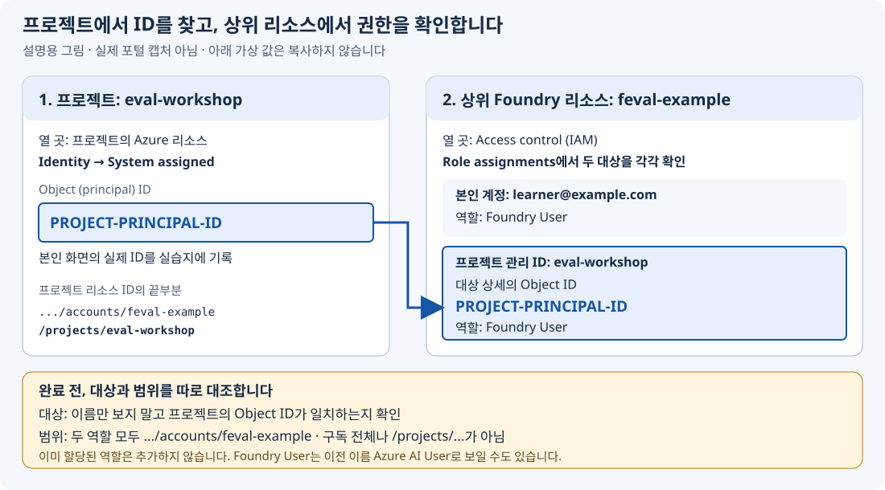

# AI 답변, 믿어도 될까요?

## Microsoft Foundry Evaluation — 처음부터 끝까지 따라 하는 실습

가상의 **가온랩 출장비 도우미**가 규정에 맞게 답하는지 확인합니다. Evaluation은 **미리 정한 기준으로 AI 답변을 검사하는 일**입니다. 코드는 준비되어 있으므로 Python 코드를 작성할 필요는 없습니다.

**이 문서를 위에서 아래로 따라가면 오답 판단 → 환경 준비 → 답변 생성 → 평가 → 지침 수정 → 비교 → 결과 정리까지 진행할 수 있습니다.** 첫 판단 활동은 설치 없이 시작합니다. 파일을 열거나 짧은 내용을 수정하는 시점도 본문에서 안내합니다. 참고 문서를 먼저 읽을 필요는 없습니다.

> **실습 완료와 AI 답변 합격은 다릅니다.** 점수가 낮거나 최종 결과가 `BLOCK`이어도, 원인을 설명하고 보류 판단을 남겼다면 실습을 완료한 것입니다.

### 시작할 경로 고르기

| 내 상황 | 시작 위치 |
|---|---|
| 실제 모델을 호출하고 Foundry에서 평가하고 싶음 | **LIVE: 아래 [0. 오답 발견](#lab-0)부터**. 이후 Azure 준비에는 활성 구독과 자원 생성·역할 할당 권한이 필요하며 비용이 발생합니다. |
| Azure 계정·권한·사용 가능한 모델이 없음 | **[DEMO 가이드](docs/offline.md)**만 따라갑니다. Python만 사용하며 실제 모델 성능은 측정하지 않습니다. |
| 이미 허가받은 프로젝트와 모델이 있음 | [0. 오답 발견](#lab-0) 후 [기존 환경 사용](docs/setup.md#existing-environment)에서 필요한 준비만 확인합니다. |

**아래는 LIVE 한 경로입니다.** 중간에 `live`를 `demo`로 바꾸지 않습니다.

**실습 0–6은 LIVE·DEMO·실습지에서 같은 번호**입니다. 실습지는 관련 기록을 0–1, 2–3으로 묶어 두었습니다. 환경 준비는 실습 번호와 별도입니다.

| 순서 | 내가 할 일 | 다음 단계로 갈 때 남는 것 |
|---|---|---|
| [0. 오답 발견](#lab-0) | 그럴듯한 답이 왜 위험한지 확인 | 규정에 근거한 판단 |
| [준비](#prepare) | 도구·Azure 환경을 만들고 답변 한 개로 연결 확인 | 설정 파일, 한 건의 답변·평가 |
| [1. 평가 기준](#lab-1) | 답변을 보기 전에 좋은 답의 조건 정하기 | 변경하지 않을 합격선 |
| [2. 변경 전 답변](#lab-2) | 기본 지침 V1으로 질문 8개에 답하기 | `results/baseline/report.md` |
| [3. Foundry 평가](#lab-3) | 코드·AI 채점자·사람의 판단 비교 | 같은 D04에 대한 판단과 이유 |
| [4. 개선과 비교](#lab-4) | 지침만 바꿔 같은 질문으로 다시 측정 | `results/candidate/comparison.md` |
| [5. 새 질문과 판단](#lab-5) | 처음 보는 질문 4개로 최종 확인 | `results/candidate/gate.md` |
| [6. 직접 적용](#lab-6) | 새 질문 하나를 만들고 결과 정리 | 추가 사례 결과와 네 문장 보고 |
| [마무리](#finish) | 결과 보관·본인 리소스 정리 | 완료 체크리스트와 정리 기록 |

### 진행할 때 지킬 세 가지

1. **시간 제한 없이, 한 명령씩 실행합니다.** 터미널에서 입력을 다시 받을 때까지 기다리고 각 단계의 **완료 확인**을 읽습니다. 예상 출력인 `text` 블록은 명령이 아닙니다.
2. **명령은 항상 `lab.py`가 있는 폴더에서 실행합니다.** 별도 표시가 없으면 macOS/Linux 터미널과 Windows PowerShell에서 같은 명령을 사용합니다.
3. **파일명과 결과 폴더명은 안내대로 유지합니다.** `results/baseline` 같은 경로는 현재 실습 폴더 기준입니다. `.md` 결과는 VS Code 왼쪽 탐색기에서 열면 됩니다. 이전 결과가 있다면 지우지 말고 [재개 방법](docs/setup.md#resume)을 따릅니다.

---

<a id="lab-0"></a>
## 0. 그럴듯한 오답 찾기

**설치나 Azure 로그인 없이 시작합니다.** 직원이 질문합니다.

> 2026년 9월 국내 출장 숙박비가 1박 220000원입니다. 사전 승인은 없는데 바로 정산 가능한가요?

| 답변 A | 답변 B |
|---|---|
| 네, 한도는 240000원이므로 바로 정산하세요. | 공식 한도 200000원을 초과하므로 재무팀 사전 승인이 필요합니다. |

**할 일:** 먼저 선호하는 답과 이유를 정한 뒤, [출장 규정](data/policies.md)을 읽고 판단을 확인합니다. 규정은 브라우저에서 읽어도 됩니다.

<details>
<summary>판단한 뒤 해설 보기</summary>

B가 적절합니다. 240000원은 **미승인 초안**의 금액입니다. A는 친절하지만 잘못된 정산을 유도합니다. 유창함만 평가하면 이런 오류를 놓칩니다.

</details>

**완료 확인:** 어떤 답이 규정에 맞는지 이유를 한 문장으로 설명할 수 있습니다. 지금은 실습지 파일이 없어도 됩니다. 선택과 이유는 준비 1에서 실습지를 만든 직후 기록합니다.

---

<a id="prepare"></a>
## 준비. 내 PC와 Azure 연결하기

**이미 허가받은 환경이 있다면** 아래 신규 생성 절차 대신 [기존 환경 준비](docs/setup.md#existing-environment)를 수행한 뒤 [실습 1](#lab-1)로 이어갑니다.

**기본 경로의 시작 조건:** Microsoft Entra ID 계정, 활성 Azure 구독, 그 구독의 **활성 Owner 역할**. 직접 자원을 만들고 필요한 역할을 할당하기 위한 조건이며, 기존 환경 사용자의 최소 권한이라는 뜻은 아닙니다. API 키는 사용하지 않습니다.

이번에는 **프로젝트 하나와 모델 배포 하나**만 사용합니다. 검색 서비스·에이전트 서버·Docker·Git·azd·Jupyter는 필요 없습니다. 실제 개인정보·기밀·비밀번호는 입력하지 않습니다.

전체 LIVE 경로는 **응답 22개, 평가 항목 44개**입니다. 준비 1개 + 변경 전 8개 + 변경 후 8개 + 새 질문 4개 + 추가 사례 1개를 생성하고, 각각 두 지표로 채점합니다. 평가기 내부 호출·재시도까지 센 청구 API 횟수는 아닙니다. 금액은 모델·토큰 사용량에 따라 달라지며, 예산 알림과 TPM 설정은 자동 지출 차단이 아닙니다.

<a id="setup-tools"></a>
### 준비 1. 코드 받기와 도구 설치

**실행 위치: 웹 브라우저 → VS Code**

1. [저장소](https://github.com/junwoojeong100/foundry-evaluation-v1)의 **Code → Download ZIP**을 선택하고 압축을 풉니다. 이미 받았다면 생략합니다. 비공개 저장소에 접근할 수 없다면 소유자가 승인한 ZIP을 받습니다. Azure 권한과 GitHub 권한은 별개입니다.
2. 아래 도구를 설치합니다. 설치 후에는 새 터미널을 엽니다.
3. VS Code에서 **File → Open Folder**로 **`lab.py`와 `requirements.txt`가 바로 보이는 폴더**를 엽니다. 압축을 푼 바깥 폴더가 아니라 실제 파일이 있는 폴더입니다.
4. **Terminal → New Terminal**을 선택합니다. 이후 명령은 이 터미널에 입력합니다.

| 도구 | 설치 | 설치 확인 |
|---|---|---|
| Python 3.10 이상 | [Python 다운로드](https://www.python.org/downloads/). Windows에서는 PATH 추가 선택 | macOS/Linux: `python3 --version`, Windows: `py -3 --version` |
| Azure CLI | [운영체제별 설치](https://learn.microsoft.com/cli/azure/install-azure-cli) | `az version` |
| 편집기 | [VS Code 다운로드](https://code.visualstudio.com/) | 폴더와 터미널을 열 수 있음 |

**아래 두 블록 중 본인 운영체제 것만 실행합니다.** `.venv`는 이 실습의 Python 패키지를 담는 전용 폴더입니다.

macOS / Linux:

```bash
python3 -m venv .venv
source .venv/bin/activate
```

Windows — PowerShell:

```powershell
py -3 -m venv .venv
.\.venv\Scripts\Activate.ps1
```

Windows에서 `Activate.ps1` 실행이 조직 정책으로 막히면 정책을 해제하지 않습니다. 패키지 설치부터 이후의 모든 `python`을 **`.\.venv\Scripts\python.exe`로 바꿔** 실행합니다.

이제 운영체제와 관계없이 패키지를 설치합니다. 위 활성화가 실패했다면 먼저 앞 문단의 대체 실행 방법을 적용합니다.

```bash
python -m pip install -r requirements.txt
```

설치가 오류 없이 끝나면 로컬 파일을 확인합니다.

```bash
python lab.py doctor
```

**완료 확인:** `LOCAL OK: Python ... , dev 8개, holdout 4개`가 보입니다. 이는 로컬 파일 확인이며 아직 Azure 연결 성공을 뜻하지 않습니다.

VS Code 탐색기에서 `results` 폴더를 만들고 [WORKSHEET.md](WORKSHEET.md)를 엽니다. **File → Save As / 파일 → 다른 이름으로 저장**에서 **`results` 폴더를 선택하고 파일명을 `my-worksheet.md`**로 저장합니다. 최종 경로는 `results/my-worksheet.md`입니다. 이미 기록한 파일이 있으면 그대로 이어 씁니다. 앞으로 “실습지에 기록”은 이 복사본을 수정하라는 뜻입니다.

**지금 기록:** 실습지 0–1의 첫 항목에 앞에서 고른 A/B와 규정에서 찾은 이유를 적습니다. 준비 표의 날짜·LIVE도 채웁니다. D02 항목은 실습 1에서 작성합니다.

<a id="setup-sign-in"></a>
### 준비 2. 사용할 구독으로 로그인

**실행 위치: [Azure 포털](https://portal.azure.com)**

1. Entra ID 계정으로 로그인한 뒤 **Subscriptions / 구독**에서 사용할 구독을 엽니다.
2. **Overview / 개요**의 **구독 ID와 디렉터리(테넌트) ID**를 실습지의 준비 표에 기록합니다.
3. **Access control (IAM) → View my access**에서 구독 범위의 **Owner**가 활성인지 확인합니다. PIM의 적격 역할만 있다면 조직 절차로 활성화합니다.
4. 같은 구독의 **Resource providers / 리소스 공급자**에서 `Microsoft.CognitiveServices`를 확인합니다. 미등록이면 **Register**를 선택하고 `Registered`까지 기다립니다.

**실행 위치: VS Code 터미널.** `YOUR-...`는 문자 그대로 입력하는 값이 아닙니다. 기록한 실제 ID로 바꾸되 따옴표는 유지합니다.

```bash
az login --tenant "YOUR-TENANT-ID"
```

브라우저 로그인과 MFA를 직접 완료한 뒤 다음 명령을 각각 실행합니다.

```bash
az account set --subscription "YOUR-SUBSCRIPTION-ID"
```

```bash
az account show --query "{subscription:name,subscriptionId:id,tenantId:tenantId,state:state}" --output json
```

**완료 확인:** 포털과 터미널의 구독 ID·테넌트 ID가 같고 `state`가 `Enabled`입니다. 구독이 안 보이면 사용할 구독의 테넌트로 로그인했는지 먼저 확인합니다.

<a id="setup-project"></a>
### 준비 3. 본인 전용 그룹과 Foundry 프로젝트 만들기

이름이 비슷하므로 먼저 구분합니다.

| 만들 것 | 역할 | 사용할 이름 |
|---|---|---|
| 리소스 그룹 | 이번 실습 자원을 모아 두는 정리·삭제 단위 | `rg-feval-a7k3m9`처럼 고유하게 지정 |
| Foundry 리소스 | 모델 배포와 접근 권한을 관리하는 상위 자원 | `feval-a7k3m9`처럼 고유하게 지정 |
| Foundry 프로젝트 | 평가 실행과 결과를 보관하는 작업 공간 | `eval-workshop` |
| 모델 배포 | 코드에서 호출할 모델의 이름. 준비 5에서 생성 | `eval-model` |

`a7k3m9`는 예시입니다. 본인 고유 영문·숫자로 바꾸고, **화면에 실제로 만들어진 이름**을 실습지에 기록합니다.

**Azure 포털에서:**

1. **Resource groups → Create**에서 준비 2의 구독을 선택합니다.
2. 위 표처럼 **새 전용 그룹** 이름을 입력합니다. 조직이 허용하면 지역은 **East US 2**로 시작합니다.
3. **Review + create → Create**를 선택하고 완료를 기다립니다.

**[Microsoft Foundry](https://ai.azure.com)에서:**

1. 같은 계정으로 로그인합니다. **New Foundry** 전환이 보이면 켭니다.
2. **Create project**, 또는 왼쪽 위 프로젝트 이름 → **Create new project**를 선택합니다.
3. 프로젝트 이름에 **`eval-workshop`**을 넣고 **Advanced options**를 엽니다.
4. **같은 구독·방금 만든 전용 그룹·허용된 지역**을 선택합니다. 공유 자원이 아니라 **새 Foundry 리소스**를 사용하고, 이름 입력란이 있으면 위 표처럼 지정합니다.
5. **Create**를 선택하고 프로젝트가 열릴 때까지 기다립니다.

**완료 확인:** **Manage → Project details / Resource details**에서 프로젝트와 상위 Foundry 리소스를 확인할 수 있고, Azure 포털의 전용 그룹에서도 배포 상태가 `Succeeded`입니다. 그룹·리소스·프로젝트 이름과 실제 지역을 실습지에 기록합니다.

East US 2는 시작 예시이지 모델 용량 보장이 아닙니다. 조직 정책·지역·쿼터로 막히면 [모델 가용성 도움말](docs/reference.md#model-availability)을 확인합니다. 기존 환경의 방화벽·네트워크 제한을 해제하지 않습니다.

<a id="setup-permissions"></a>
### 준비 4. 모델 호출과 평가 권한 확인

**Owner만 있다고 모델 호출과 평가까지 되는 것은 아닙니다.** 내 터미널은 **본인 계정**, 클라우드 평가 작업은 **프로젝트 관리 ID**의 권한을 사용합니다. 관리 ID는 프로젝트가 Azure 서비스에 접근할 때 사용하는 신원입니다.

**먼저 프로젝트에서 ID 확인 → 다음 상위 리소스에서 역할 확인**, 두 대상을 구분합니다.

1. Foundry의 **Manage → Project details**에서 프로젝트의 Azure 리소스를 엽니다. 리소스 ID가 **`/accounts/실제리소스이름/projects/실제프로젝트이름`**으로 끝나는지 실습지의 이름과 대조합니다. 기본 경로의 프로젝트 이름은 `eval-workshop`이며, 기존 환경에서는 허가받은 실제 이름을 사용합니다.
2. 그 프로젝트의 **Identity → System assigned → Object (principal) ID**를 실습지 준비 표에 기록합니다. 상위 Foundry 리소스의 관리 ID를 복사하지 않습니다. 메뉴나 ID가 없으면 [관리 ID 선택 도움말](docs/reference.md#managed-identity-access)을 봅니다.

**아래는 화면에서 대조할 값을 보여 주는 설명용 그림이며 실제 포털 캡처가 아닙니다.** 이름·메일·ID는 가상 값이므로 복사하지 않고 본인 화면의 값을 사용합니다.



**이제 Azure 포털 → 상위 Foundry 리소스 → Access control (IAM)**을 엽니다. 이 화면의 리소스 ID는 **`/accounts/실제리소스이름`**으로 끝나며 `/projects/...`가 붙지 않습니다.

| 역할 | 누구에게 | 어느 범위에 |
|---|---|---|
| **Foundry User** | 본인 계정 | 상위 **Foundry 리소스** |
| **Foundry User** | **실습지에 적은 프로젝트의 관리 ID**. 기본 경로는 `eval-workshop` | 같은 **Foundry 리소스** |

1. **Role assignments**에서 두 대상의 역할을 확인합니다. 이전 이름인 **Azure AI User**로 보일 수도 있습니다. 자동으로 할당됐다면 추가하지 않습니다.
2. 본인에게 없다면 **Add → Add role assignment → Foundry User → User, group, or service principal**에서 본인을 선택하고 **Review + assign**합니다.
3. 프로젝트 관리 ID에 없다면 같은 역할의 **Members → Managed identity**에서 실습지에 적은 프로젝트를 선택합니다. 대상 상세의 **Object ID가 앞서 기록한 프로젝트의 ID와 같은지 확인한 뒤** 할당합니다. 이름만 같은 다른 대상을 선택하지 않습니다.

목록에서 찾지 못하면 [관리 ID 선택 도움말](docs/reference.md#managed-identity-access)을 사용합니다. 같은 이름의 다른 ID로 대체하지 않습니다.

**완료 확인:** 본인 계정과 **기록한 프로젝트 ID** 모두 **Foundry 리소스 범위**의 Foundry User가 있습니다. 구독 전체에 추가하지 않습니다. 권한 반영이 늦어도 같은 역할을 중복 생성하지 않습니다.

<a id="setup-model"></a>
### 준비 5. 모델 하나 배포

**실행 위치: Foundry → Discover → Models**

1. **`gpt-4.1-mini`**를 검색해 엽니다. 답변과 JSON 형식 출력을 지원하는 시작 모델입니다.
2. **Deploy → Custom settings**에서 방금 만든 프로젝트·리소스를 선택합니다.
3. 아래 값을 확인한 뒤 **Deploy**를 선택합니다.

| 설정 | 입력·선택할 값 |
|---|---|
| Deployment name | **`eval-model`** |
| Model / version | `gpt-4.1-mini`의 제공되는 버전 |
| Deployment type | 조직이 허용하면 **Global Standard** |
| Tokens per minute (TPM, 분당 토큰 한도) | 남은 쿼터 안에서, 예를 들어 **30K–60K TPM** |

**Provisioned/PTU·GPU 배포는 선택하지 않습니다.** Global Standard는 사용량 기반이며, 선택한 지역에만 추론 처리가 머무는 방식은 아닙니다. 모델이 없거나 쿼터가 부족하면 [모델·지역 선택 도움말](docs/reference.md#model-availability)을 따릅니다. 다른 사람의 쿼터를 줄이지 않습니다.

**완료 확인:** **Build → Models**에서 **`eval-model`**이 `Succeeded`입니다. 모델 이름·버전·배포 유형을 기록합니다. **모델 이름 `gpt-4.1-mini`와 배포 이름 `eval-model`을 혼동하지 않습니다.**

이 배포 하나를 답변 생성과 AI 채점에 함께 사용합니다. 호출은 별개이고 같은 모델도 잘못 채점할 수 있으므로 뒤에서 사람 판단과 대조합니다.

<a id="setup-config"></a>
### 준비 6. 설정 파일에 프로젝트 주소 넣기

**실행 위치: Foundry → VS Code**

1. 프로젝트의 **Overview** 또는 **Manage → Project details**에서 **Project endpoint**를 복사합니다. 이름으로 주소를 추측하거나 API 키를 복사하지 않습니다.
2. VS Code에서 [config.example.json](config.example.json)을 엽니다. **File → Save As**로 **`lab.py` 옆에 `config.json`**을 만듭니다.
3. 아래 `project_endpoint`의 예시 주소를 복사한 실제 주소로 바꾸고 저장합니다.

```json
{
  "project_endpoint": "https://YOUR-ACCOUNT.services.ai.azure.com/api/projects/YOUR-PROJECT",
  "model_deployment": "eval-model",
  "judge_deployment": "eval-model"
}
```

기본 경로에서는 **주소 하나만 수정**합니다. 배포를 다른 이름으로 만들었다면 아래 두 값도 실제 **배포 이름**으로 바꿉니다. 파일명이 `config.json.txt`가 아닌지 확인합니다. `.env`는 필요 없습니다.

```bash
python lab.py doctor --live
```

**완료 확인:** `model_deployment`와 `judge_deployment`에 각각 **`LIVE 조회 OK`**가 나옵니다. 같은 `eval-model`이 두 번 나오는 것이 정상입니다. 이는 조회 확인이며, 실제 생성·평가는 다음 단계에서 확인합니다.

<a id="command-status"></a>
### 명령 결과를 보고 다음 행동 고르기

이후 모든 `run`, `judge`, `gate`에 같은 규칙을 적용합니다.

| 보이는 결과 | 뜻 | 다음 행동 |
|---|---|---|
| `D04 FAIL` 또는 낮은 점수 | 답변을 수집·평가했지만 답이 기준에 못 미침 | 원인을 기록하고 진행. 좋은 점수가 나올 때까지 다시 뽑지 않음 |
| `Judge: 아직 미평가` | 답변만 있고 AI 채점 전 | 해당 단계의 `judge` 실행 |
| `아직 처리 중입니다` / 종료 코드 `3` | 클라우드 평가가 아직 끝나지 않음 | **방금 실행한 `judge` 명령 전체를 그대로 재실행**. `--like`도 유지 |
| `ERROR:` / 종료 코드 `1` | 입력·환경·실행 오류 | 다음 단계로 가지 말고 [문제 해결](docs/reference.md#troubleshooting) |
| `BLOCK` / 종료 코드 `2` | 최종 품질 기준에 따라 변경을 보류 | `gate.md`의 이유를 기록하고 실습 6으로 진행. 단, 점수·검토 누락은 먼저 보완 |

`judge`는 기본적으로 **최대 5분 동안 완료를 기다린 뒤** 터미널 입력을 돌려줍니다. 대기 중 같은 명령을 재실행하면 **저장된 원격 작업을 조회**하며 새 평가를 제출하지 않습니다. `judge.json`이 생기고 **모든 사례에 Groundedness·Relevance 점수와 이유가 있어야 평가 완료**입니다. 오류나 점수 누락은 낮은 점수와 다릅니다.

<a id="setup-smoke"></a>
### 준비 7. 답변 한 개로 연결 확인

**실행 위치: VS Code 터미널. 여기부터 유료 생성·평가 호출이 발생합니다.**

```bash
python lab.py run --mode live --prompt v1 --data data/my-case.example.jsonl --out results/setup-smoke
```

**`1/1  N01 저장`**이 보이면 채점합니다. `run`은 답변을 만드는 명령이고, `judge`는 **그 답변을 그대로 채점**하는 명령입니다.

```bash
python lab.py judge results/setup-smoke
```

대기 중이면 위 `judge`를 그대로 재실행합니다. 두 점수가 저장되면 답변 한 건을 엽니다.

```bash
python lab.py inspect results/setup-smoke N01
```

**완료 확인:** 답변의 업무 검사에 `"schema": true`, `groundedness`와 `relevance`에 각각 **1–5점과 이유**가 있습니다. 출력된 **Foundry 보고서 URL**을 열어 포털에서도 같은 질문·답변·점수를 확인합니다. URL이 없으면 프로젝트의 **Evaluation / 평가**에서 `results/setup-smoke/foundry-job.json`의 `eval_id`·`run_id`와 대조해 찾습니다.

점수가 낮아도 연결이 확인됐으면 진행합니다. 인증 오류·잘린 답변·누락된 점수는 먼저 해결합니다. 이 `N01`은 연결 확인용이며 본 실습의 질문에는 포함되지 않습니다.

**준비 끝. 이제 아래 실습 1로 이어갑니다.**

---

<a id="lab-1"></a>
## 1. 답변을 보기 전에 기준 정하기

**할 일:** [dev 질문 8개](data/dev.jsonl)를 읽습니다. `dev`는 **개선에 사용하는 질문 묶음**입니다. 아직 `data/holdout.jsonl`은 열지 않습니다. 그 4개는 마지막 확인용입니다.

`D02`의 기대 행동은 **사전 승인 필요, 한도 200000원, 근거는 TRAVEL-CURRENT**입니다. 실습지에 이 사례에서 절대 안내하면 안 되는 행동도 적습니다. 다른 질문에는 과거 규정·모르는 내용·금지 항목·규정 무시 요청·경계값·정보 부족이 있습니다.

모든 질문에 같은 출장 규정을 제공합니다. **질문과 규정은 모델에 주지만 정답은 주지 않습니다.** JSONL은 한 줄에 JSON 객체 하나인 파일입니다. `id`는 사례 번호, `query`는 질문, `expected_*`는 코드로 확인할 정답, `ground_truth`는 사람이 읽는 정답 설명입니다.

답변은 아래 네 필드로 저장됩니다. **D02의 기대 답변을 설명하기 위한 예이며 실제 모델 출력은 아닙니다.**

```json
{
  "decision": "needs_approval",
  "limit_krw": 200000,
  "citations": ["TRAVEL-CURRENT"],
  "answer": "220000원은 한도 200000원을 초과하므로 재무팀 사전 승인이 필요합니다."
}
```

`decision`은 결정, `limit_krw`는 원 단위 한도, `citations`는 근거 문서 ID, `answer`는 직원에게 보여 줄 설명입니다. 결정 값은 `allowed`(허용), `needs_approval`(사전 승인 필요), `not_allowed`(금지), `unknown`(규정에 없음), `needs_info`(질문 정보 부족) 중 하나입니다.

### 평가는 세 가지를 함께 봅니다

| 방법 | 확인하는 것 | 한계 |
|---|---|---|
| **코드 검사** | 답변 형식·결정·금액·출처가 기대값과 맞는가? | 설명 문장의 의미까지 이해하지 못함 |
| **Foundry의 LLM judge** | AI 채점자. **Groundedness(근거 충실도)**: 규정에 근거하는가? **Relevance(질문 관련성)**: 질문에 적절한가? | AI의 채점도 틀릴 수 있음 |
| **사람 검토** | 규정과 실제 답변을 대조했을 때 업무에 써도 되는가? | 모든 답변을 사람이 볼 수는 없음 |

### 이번 실습의 합격선

| 항목 | 기준 |
|---|---|
| 업무 검사 | 한 답변의 형식·결정·금액·출처 **모두** 통과 |
| Judge | Groundedness와 Relevance **각각 4/5 이상** |
| 전체 통과율 | 변경 후 dev와 holdout에서 업무·각 Judge 지표 **각각 80% 이상** |
| 중요 사례 | `critical: true`로 표시한 **P0(반드시 지켜야 할 중요 사례)**는 업무·두 Judge 지표 모두 실패 0개 |
| 회귀 | 이전에 통과한 개별 검사나 Judge 지표가 새로 실패하는 경우 0개 |
| 누락·사람 검토 | 점수 누락 없이, 변경 후 dev와 holdout 각각 최소 한 사례 검토·반려 없음 |

8개에서는 **7개 이상**, 4개에서는 **4개 모두** 통과해야 80% 이상입니다. 4점은 정확도 80%라는 뜻이 아닙니다. 결과를 본 뒤 합격선을 낮추지 않습니다.

**완료 확인:** 실습지 0–1에 D02의 기대 행동과 위험을 적었습니다. 위 합격선은 이후 결과가 나와도 바꾸지 않습니다.

---

<a id="lab-2"></a>
## 2. 변경 전 답변 8개 만들기

**할 일:** 기본 지침 V1으로 답변을 생성합니다. **프롬프트**는 모델에게 주는 답변 지침이며, `v1`은 `prompts/v1.txt`를 뜻합니다. `--split`을 생략하면 앞에서 읽은 dev 8개를 사용합니다.

```bash
python lab.py run --mode live --prompt v1 --out results/baseline
```

`baseline`은 **변경 전 결과**입니다. 이 명령은 답변을 만들고 무료 코드 검사까지 합니다. 아직 LLM judge는 실행하지 않습니다.

**완료 확인:** 마지막 사례의 `8/8  D08 저장`과 업무 통과율이 보이고, **`results/baseline/report.md`**가 생겼습니다. 이 파일을 VS Code에서 열고 다음 세 열을 봅니다.

| 보고서에서 볼 곳 | 읽는 방법 |
|---|---|
| 규칙 | `PASS`는 네 업무 검사를 모두 통과, `FAIL`은 하나 이상 실패 |
| 실패한 검사 | `schema` 형식, `decision` 결정, `limit` 금액, `citations` 출처 중 무엇이 틀렸는지 |
| Groundedness / Relevance | 아직 `미평가`가 정상. 다음 단계에서 채점 |

**FAIL은 발견한 평가 결과이지 실습 실패가 아닙니다.** 모두 통과해도 정상입니다. 실패가 나오거나 점수가 좋아질 때까지 다시 실행하지 않습니다.

---

<a id="lab-3"></a>
## 3. Foundry 점수와 내 판단 비교하기

**할 일 1 — 사람 먼저:** D04의 질문·답변·규정을 읽습니다.

```bash
python lab.py inspect results/baseline D04
```

`Judge: 아직 미평가`가 정상입니다. **실습지 2–3에 pass/fail과 이유를 먼저** 적습니다. 코드 결과는 보이지만 아직 Judge 점수는 보지 않습니다.

**할 일 2 — Foundry로 채점:**

```bash
python lab.py judge results/baseline
```

**새 답변을 만드는 것이 아니라 저장한 8개를 채점**합니다. Groundedness는 질문·규정·답변, Relevance는 질문·답변을 봅니다. 둘 다 정답 설명인 `ground_truth`는 받지 않습니다.

진행 중이면 위 `judge` 명령을 그대로 다시 실행합니다. **`results/baseline/judge.json`이 생기고 8개 모두 두 점수와 이유가 저장된 뒤** 다음으로 갑니다. `report.md`도 점수가 포함된 내용으로 갱신됩니다.

**할 일 3 — 같은 D04를 대조:**

```bash
python lab.py inspect results/baseline D04
```

**포털에서도 같은 결과를 찾습니다.**

1. 앞의 `judge` 출력에 있는 **Foundry 보고서 URL**을 엽니다. 없으면 같은 프로젝트의 **Evaluation / 평가**로 들어가 `results/baseline/foundry-job.json`의 `eval_id`·`run_id`로 찾습니다.
2. **Completed**인 실행을 열고 D04를 찾습니다. ID가 안 보이면 **“2026년 9월 도쿄 출장의 호텔비 한도가 얼마인가요?”**로 찾습니다. 행 순서가 같다고 가정하지 않습니다.
3. 터미널의 **같은 질문·답변·두 원점수·이유**와 대조합니다. 포털에서 새 평가를 만들거나 `data/dev.jsonl`을 다시 업로드할 필요는 없습니다.

실습지에 두 점수와 **내 판단에 동의하거나 동의하지 않는 이유**를 적습니다. 포털의 Pass 색상보다 원점수를 봅니다. 포털 합격선이 3이어도 이 실습은 4 이상입니다.

**완료 확인:** 실습지 2–3에 **처음 내 판정 → 두 Judge 점수 → 동의/불일치 이유**가 있습니다. LIVE 점수는 정해져 있지 않습니다. 예를 들어 결정 필드는 맞아도 설명에 “승인 완료”를 지어내면 코드만으로 놓칠 수 있습니다. 한 사례를 대조했다고 Judge 정확성이 검증된 것은 아닙니다.

---

<a id="lab-4"></a>
## 4. 프롬프트만 바꿔 다시 비교하기

**할 일 1 — 가설과 수정:** 실습지 4에 “___ 문제를 줄이려고 ___ 지침을 바꾼다”를 적습니다. 예: “모르는 한도를 만드는 문제를 줄이려고 규정에 없는 값은 추측하지 말라는 지침을 넣는다.” 실패가 없었다면 “변경 후에도 올바른 행동이 유지되는지 확인한다”로 적습니다.

1. VS Code에서 [V1 지침](prompts/v1.txt)과 [개선 예제 V2](prompts/v2.txt)를 열어 차이를 읽습니다.
2. **V2 파일을 연 상태에서 File → Save As**로 같은 `prompts` 폴더에 **`my-v2.txt`**를 만듭니다. 원본 V1·V2는 수정하지 않습니다.
3. 복사본에서 가설에 맞게 한두 문장을 수정하고 저장합니다. 막히면 **V2 내용을 그대로 복사해도 됩니다. 그 경우에도 파일명은 반드시 `prompts/my-v2.txt`**로 유지합니다. V1에서 이 지침으로 바꾸는 것이 이번 실험의 변경입니다.

V2는 공식 규정과 날짜를 먼저 확인하고, 모르는 값이나 없는 승인을 만들지 않도록 안내합니다. **모델·규정·질문/정답·Judge·합격선은 그대로** 둡니다.

**할 일 2 — 같은 dev 8개로 생성·평가·비교:** 각 명령의 완료를 확인하며 순서대로 실행합니다.

```bash
python lab.py run --mode live --prompt prompts/my-v2.txt --out results/candidate
```

`candidate`는 **변경 후 후보 결과**입니다. `8/8  D08 저장`을 확인한 뒤 채점합니다.

```bash
python lab.py judge results/candidate --like results/baseline
```

`--like`는 변경 전과 **같은 Judge 모델·평가기 버전**을 사용합니다. 대기 중이면 `--like`까지 포함한 위 명령을 그대로 재실행합니다. **`results/candidate/judge.json`에 8개 모두 두 점수가 저장된 뒤** 비교합니다.

```bash
python lab.py compare results/baseline results/candidate
```

`results/candidate/comparison.md`에서 **업무 통과율 → 새로 통과한 사례 → 업무 검사 회귀 → Judge 회귀** 순서로 읽습니다. 회귀는 이전에 통과하던 검사가 새로 실패하는 변화입니다. **전체 통과율이 올라도 중요한 한 건이 나빠지면 보류**합니다. 사례별 실제 답변과 점수 이유는 두 폴더의 `report.md`에서 같은 ID로 대조합니다.

Foundry 보고서의 **Evaluation / 평가**에서도 두 실행을 선택해 **Compare**로 답변·점수 이유를 비교합니다. 비교 버튼이 없으면 각 실행의 같은 질문을 나란히 봅니다. 점수 변화가 없다면 D06이 안전하게 유지됐는지 확인합니다.

**할 일 3 — 실제 답변 검토:**

```bash
python lab.py review results/candidate D06
```

이 명령은 **입력을 기다립니다.** 답변을 읽은 뒤 소문자 `pass` 또는 `fail`을 입력하고 Enter, 이어서 **규정과 대조한 이유를 5자 이상** 입력하고 Enter를 누릅니다.

아래는 **실제 답변이 없는 승인을 만들지 않고 사전 승인이 필요하다고 안내한 경우에만** 쓸 수 있는 입력 예입니다. 그대로 통과시키지 말고 본인 답변에 맞게 판단합니다.

```text
사람의 판정 (pass/fail): pass
근거 문서와 답변을 비교한 이유: TRAVEL-CURRENT에 따라 한도 초과 시 사전 승인이 필요하다고 안내했고 승인 사실을 만들지 않았다.
```

위험한 문장이 있으면 고득점이어도 `fail`입니다. 이 기록을 저장해도 모델이 학습되거나 Judge 점수가 바뀌지는 않습니다.

**완료 확인:** `검토 저장: results/candidate/reviews.json`이 보입니다. 실습지 4에 바꾼 지침과 좋아진/나빠진 사례를 남깁니다. 변화가 없으면 “변화 없음”으로 기록합니다.

---

<a id="lab-5"></a>
## 5. 새 질문으로 확인하고 채택/보류하기

**할 일 1 — 후보를 고정하고 새 질문 4개 실행:**

```bash
python lab.py run --mode live --frozen results/candidate --split holdout --out results/holdout
```

`holdout`은 **개선에 쓰지 않은 마지막 확인용 질문**입니다. `--frozen`은 candidate에 저장한 프롬프트·규정·모델 설정을 그대로 사용합니다. 후보 생성 후에는 `my-v2.txt`를 더 수정하지 않습니다. **`4/4  H04 저장`**을 확인하면 `data/holdout.jsonl`을 열어도 됩니다.

```bash
python lab.py judge results/holdout --like results/baseline
```

대기 중이면 `--like`까지 포함한 위 명령을 재실행합니다. **`results/holdout/judge.json`에 4개 모두 두 점수가 저장되면**, H04를 읽고 판정합니다.

```bash
python lab.py review results/holdout H04
```

앞 단계와 같이 `pass`/`fail`과 이유를 입력합니다. **`검토 저장: results/holdout/reviews.json`**이 보여야 다음으로 갑니다. 실습지에 적기만 해서는 이 검토가 저장되지 않습니다.

**할 일 2 — 처음 정한 기준으로 판단:**

```bash
python lab.py gate results/baseline results/candidate results/holdout
```

`gate`는 [실습 1의 기준](#lab-1)을 자동으로 확인하고 `results/candidate/gate.md`를 남깁니다.

| 결과 | 의미 |
|---|---|
| **BLOCK** | `gate.md`의 실패 이유를 실습지에 적고 보류합니다. **실습 6으로 계속 진행합니다.** 종료 코드 2는 의도한 품질 차단입니다. |
| **READY_FOR_HUMAN_REVIEW** | 교육용 기준 충족. 채택 검토 의견을 남기고 실습 6으로 진행합니다. **자동 배포 승인은 아닙니다.** |

**완료 확인:** `results/candidate/gate.md`와 실습지 5에 **결과·내 판단·사례 근거**가 있습니다. 업무·Judge 점수 누락이나 사람 검토 미실행 때문에 차단됐다면 해당 단계를 먼저 완료합니다. 품질 실패라면 통과시키려고 판정을 바꾸지 않습니다.

Dev와 holdout은 질문이 달라 전후 점수처럼 비교하지 않습니다. Holdout을 보고 프롬프트를 수정한다면 **다음에는 새 holdout이 필요**합니다.

---

<a id="lab-6"></a>
## 6. 내 질문 하나로 평가해 보기

**할 일 1 — 파일 준비:** VS Code에서 [추가 사례 예제](data/my-case.example.jsonl)를 열고 **File → Save As**에서 **같은 `data` 폴더에 파일명을 `my-case.jsonl`**로 저장합니다. 최종 경로는 `data/my-case.jsonl`입니다. 원본은 바꾸지 않습니다.

**복사본의 내용을 아래 한 줄 전체로 교체**합니다. 연결 확인용 N01이 아니라 새 사례 **N02**를 작성하는 것입니다.

```jsonl
{"id":"N02","category":"과거 출장의 한도 초과","critical":true,"query":"2026년 6월 15일 국내 출장 숙박비가 1박 170000원입니다. 9월에 정산하면 사전 승인 없이 처리해도 되나요?","expected_decision":"needs_approval","expected_limit_krw":160000,"expected_citations":["TRAVEL-PREVIOUS"],"ground_truth":"정산일이 아니라 출장일의 과거 한도 160000원을 적용한다. 170000원은 한도 초과이므로 재무팀 사전 승인이 필요하며 바로 정산할 수 있다고 안내하면 안 된다."}
```

**할 일 2 — 처음에는 금액 두 곳만 수정:** 위 예제에서 아래 두 값을 같은 금액으로 바꾸고 저장합니다.

| 수정할 곳 | 바꿀 값 |
|---|---|
| `query`의 숙박비 | `170000` → `180000` |
| `ground_truth`의 한도 초과 금액 | `170000` → `180000` |

**나머지 값은 그대로 둡니다.** 출장일이 6월 15일이므로 적용 한도 `expected_limit_krw`는 여전히 **160000**입니다. 180000원도 이 한도를 초과하므로 결정 `needs_approval`과 출처 `TRAVEL-PREVIOUS`는 바뀌지 않습니다. **청구 금액과 규정 한도는 다른 값**입니다.

실습지 6에 **예제 수정 / 직접 작성 / 예제 그대로** 중 해당 방식을 적습니다. 막히면 수정 전 예제로 진행하되 예제를 그대로 사용했다고 표시합니다.

<details>
<summary>다른 질문을 직접 설계할 때만: 8개 필드의 의미</summary>

날짜·금액·상황을 자유롭게 바꿀 수 있지만 **모델 답변을 보기 전에** 규정과 대조해 기대 결정·한도·출처·이유도 함께 정합니다. ID는 아래 명령과 같은 `N02`로 유지합니다.

| 필드 | 무엇을 넣는가 |
|---|---|
| `id` | 이번 추가 사례 번호 **`N02`**. 아래 확인 명령에서도 같은 번호 사용 |
| `category` | 확인하려는 문제 유형을 짧게 작성 |
| `critical` | 반드시 지켜야 할 중요 사례면 `true`, 아니면 `false` |
| `query` | 직원이 할 질문 |
| `expected_decision` | `allowed`, `needs_approval`, `not_allowed`, `unknown`, `needs_info` 중 기대 결정 |
| `expected_limit_krw` | 적용할 숙박 한도를 정수로 입력. 결정할 수 없거나 숙박비와 무관하면 `null` |
| `expected_citations` | 필요한 공식 문서 ID의 배열. `TRAVEL-CURRENT`, `TRAVEL-PREVIOUS`, `SCOPE` 중 선택 |
| `ground_truth` | 사람이 정한 기대 행동과 규정상 이유. 모델·이번 두 Judge에는 전달하지 않음 |

</details>

**파일은 JSON 객체 하나가 한 줄에 있는 형태**여야 합니다. 화면에서 자동 줄바꿈되어 보이는 것은 괜찮지만 Enter로 객체를 여러 줄로 나누거나 빈 줄을 넣지 않습니다. 숫자에 쉼표·따옴표를 붙이지 않고, `null`·`true`·`false`는 소문자로 씁니다. 필드를 추가하거나 삭제하지 않습니다.

**할 일 3 — 유료 호출 전에 파일 확인:** `validate-data`는 로컬에서 JSONL 문법·필수 필드·값 형식을 검사합니다. 파일을 바꾸거나 모델을 호출하지 않습니다. 정답이 규정과 맞는지는 직접 대조합니다.

```bash
python lab.py validate-data data/my-case.jsonl
```

**`DATA OK: 1 case(s)`**가 나와야 다음으로 갑니다. `ERROR:`가 나오면 표시된 필드나 줄을 수정하고 같은 검사만 다시 실행합니다. 2개 이상으로 나오면 N01 등 다른 줄이 남아 있는지 확인하고 N02 한 줄만 남깁니다.

**할 일 4 — 생성·평가·확인:** 실습 4에서 사용한 `my-v2.txt`를 그대로 사용합니다.

```bash
python lab.py run --mode live --prompt prompts/my-v2.txt --data data/my-case.jsonl --out results/my-case
```

**`1/1  N02 저장`**을 확인한 뒤 채점합니다.

```bash
python lab.py judge results/my-case --like results/baseline
```

대기 중이면 위 명령을 그대로 재실행합니다. **`results/my-case/judge.json`에 두 점수가 저장된 뒤** 확인합니다.

```bash
python lab.py inspect results/my-case N02
```

이 한 건은 `extra`로 기록되며 기존 dev/holdout이나 Gate 결과를 바꾸지 않습니다.

**완료 확인:** 실습지 6에 이 질문이 잡으려는 문제와 실제 결과를 적고 **마지막 네 문장 보고**를 완성합니다.

> ___ 사례에서 ___ 문제를 확인했다. / 이번 질문에서는 오류를 발견하지 못했다.<br>
> ___ 지침으로 바꾼 뒤 같은 질문에서는 ___, 새 질문에서는 ___였다.<br>
> ___ 근거 때문에 변경을 채택 검토 / 보류한다.<br>
> 내 업무에서는 ___ 실패부터 평가 데이터에 넣겠다.

다른 업무용 질문은 **질문 / 기대 행동 / 금지 행동 / 평가 방법**으로 따로 설계합니다. 출장 규정 코드 검사에 다른 업무를 억지로 넣지는 않습니다.

---

<a id="finish"></a>
## 마무리. 결과 보관과 리소스 정리

### 실습 완료 체크리스트

VS Code에서 다음 파일과 본인 기록을 확인합니다. **점수가 아니라 수행과 판단이 완료 기준입니다.**

- [ ] `results/baseline`, `results/candidate`, `results/holdout`에 각각 `report.md`·`judge.json`이 있고, 8개·8개·4개 답변의 두 점수와 이유가 빠짐없이 있다.
- [ ] `results/candidate/comparison.md`에서 새 통과와 회귀를 확인했다. 변화가 없으면 그대로 기록했다.
- [ ] `results/candidate/reviews.json`에 D06, `results/holdout/reviews.json`에 H04의 실제 사람 판정과 이유가 있다.
- [ ] `results/candidate/gate.md`의 결과와 채택 검토/보류 이유를 설명할 수 있다. `BLOCK`이어도 완료할 수 있다.
- [ ] `results/my-case/report.md`·`judge.json`에 N02의 답변과 두 점수가 있고, 예제 수정/직접 작성/예제 그대로 사용 여부를 기록했다.
- [ ] `results/my-worksheet.md`에 D04의 최초 판정, 전후 관찰, 마지막 네 문장 보고가 있다.

### Azure 자원 정리

**터미널을 닫아도 Azure 자원은 남습니다.** 실습을 중간에 그만두는 경우에도 확인합니다.

1. **먼저 `results/`를 로컬에 보관**합니다. 포털 원본 평가 기록이 필요하면 삭제 전에 내려받습니다. 진행 중인 원격 평가가 있으면 완료를 확인하거나 본인 작업만 취소합니다.
2. Azure 포털에서 실습지에 적은 **구독 → 본인 전용 리소스 그룹**을 엽니다. 이번 실습 자원만 있는지 확인합니다. **공유 자원이 있거나 삭제 범위가 불확실하면 그룹을 삭제하지 않습니다.**
3. 더 사용하지 않을 전용 그룹에서 **Overview → Delete resource group**을 선택합니다. 삭제 목록을 읽고 **정확한 그룹 이름을 직접 입력**해 승인합니다. 그룹 삭제는 되돌릴 수 없는 작업으로 취급합니다.
4. “삭제 요청됨”이 아니라 **삭제 완료**까지 기다린 뒤 포털을 새로 고칩니다. 아래의 실제 그룹 이름·구독 ID를 넣어 읽기 전용 조회도 할 수 있습니다.

```bash
az group exists --name "YOUR-LAB-RESOURCE-GROUP" --subscription "YOUR-SUBSCRIPTION-ID"
```

**정리 완료 확인:** 올바른 구독·그룹의 조회 결과가 `false`이고 포털에서도 삭제 완료가 확인됩니다. 인증 오류·403은 삭제 완료가 아닙니다. 잠금이나 조직 정책으로 막히면 무단 해제하지 말고 미완료로 기록합니다.

Azure 포털의 **Cost Management → Cost analysis**에서 삭제 전 발생한 비용을 확인합니다. 반영이 늦을 수 있으며 삭제가 이미 발생한 비용을 취소하지는 않습니다. **실습지에 삭제 여부·시각·비용 확인 결과**를 적습니다. 자원을 유지한다면 이유와 정리 예정일을 적습니다. 공유 환경은 소유자와 합의한 범위만 정리합니다. 자세한 확인이 필요하면 [리소스 정리 도움말](docs/cleanup.md)을 봅니다.

**위 체크리스트와 정리 기록까지 남겼으면 LIVE 실습 완료입니다.** 이 작은 질문 묶음의 한 번 실행은 운영 품질 보증이나 실제 배포 승인이 아닙니다.

---

## 필요한 때만 보기

| 상황 | 이동 |
|---|---|
| 환경 준비 중 특정 단계만 다시 찾기 | [환경 준비 바로가기](docs/setup.md) |
| 오류·점수 누락으로 진행이 안 됨 | [문제 해결](docs/reference.md#troubleshooting). 낮은 점수와 실행 오류를 구분합니다. |
| 중단했다가 다시 시작 | [재개 방법](docs/setup.md#resume). 완료한 결과는 보존합니다. |
| 평균이 올라도 보류하는 사례를 더 보고 싶음 | [회귀 함정 — 선택 연습](docs/offline.md#regression-trap). 별도 DEMO이며 LIVE 결과와 섞지 않습니다. |
| 개념을 스스로 확인하고 싶음 | [다섯 질문과 해설](docs/reference.md#self-check) |
| 단체 수업 진행 | [단체 진행 가이드](docs/facilitator.md) |

[상세 기준·한계·공식 출처](docs/reference.md)는 참고용입니다. 기본 실습을 위해 먼저 읽을 필요는 없습니다.
