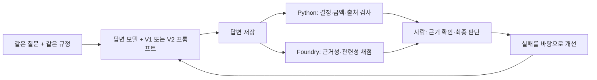

# AI 답변, 믿어도 될까요?

## 계정과 구독부터 시작하는 Microsoft Foundry Evaluation 실습

**저장소:** [junwoojeong100/foundry-evaluation-v1](https://github.com/junwoojeong100/foundry-evaluation-v1) · **작업 폴더:** `foundry-evaluation-v1`

**그럴듯한 답변을 보는 데서 끝내지 않고, AI를 바꿔도 되는지 증거로 판단하는 실습입니다.**

가상의 **가온랩 출장비 도우미** 하나로 진행합니다. 코드 대부분은 준비되어 있습니다. 여러분이 할 일은 **좋은 답의 기준을 정하고 → 실패를 찾고 → 프롬프트를 개선하고 → 같은 질문과 새 질문으로 확인하는 것**입니다.

저장소 이름의 `v1`과 실습에서 비교하는 프롬프트 `V1`/`V2`는 별개입니다. 프롬프트 파일과 실습 명령의 `v1`, `v2`는 그대로 사용합니다.

> **오늘의 성공은 높은 점수가 아닙니다. “어떤 답변이 왜 문제이고, 이 변경을 왜 채택하거나 보류하는지” 설명하면 성공입니다.**

### 시작하기

**Microsoft Entra ID 계정, 활성 Azure 구독, 해당 구독의 Owner 역할이 있다면 직접 시작할 수 있습니다.** 준비된 Foundry 프로젝트나 강사가 만든 설정 파일은 필요 없습니다. [처음부터 환경 만들기](docs/setup.md)에서 본인 전용 리소스와 모델을 준비한 뒤 아래 평가 실습으로 이어갑니다.

**기본 경로:** [환경 만들기](docs/setup.md) → 아래 실습 0–6 → [본인 리소스 정리](docs/cleanup.md).

이미 환경이 있다면 [기존 환경 확인](docs/setup.md#existing-environment), Azure를 쓸 수 없다면 [작성된 예제로 연습](docs/offline.md)을 참고합니다. 단체 진행자는 [강사 가이드](docs/facilitator.md)를 추가로 봅니다.

- **대상:** AI 평가가 처음인 개발자와 업무 담당자. Python 코드를 직접 작성할 필요는 없습니다.
- **진행 원칙:** 시간 제한 없이 **실행 → 완료 확인 → 결과 해석** 순서로 진행합니다. 준비·실습·정리 모두 포함하며, 높은 점수보다 근거 있는 판단을 목표로 합니다.
- **작업 위치:** 코드는 이 폴더의 터미널 하나와 편집기에서 실행합니다. 환경 생성·권한 설정·결과 조회·정리는 브라우저의 Azure/Foundry 포털에서 진행합니다.
- **기록:** [WORKSHEET.md](WORKSHEET.md)를 편집기에서 `results/my-worksheet.md`로 다른 이름 저장해 작성합니다. 폴더가 없으면 먼저 만듭니다.
- **혼자 진행 가능:** 동료가 있다면 실행과 판정을 나누고 역할을 교대합니다. 혼자라면 자신의 판정을 먼저 적은 뒤 규정·코드·Judge와 대조합니다.

Azure 구독 Owner는 리소스 생성과 역할 할당 권한입니다. 모델 호출·평가에는 **Foundry User 데이터 접근 권한**도 필요하며, 준비 가이드에서 본인과 프로젝트 관리 ID의 권한을 확인합니다. 구독 Owner라도 조직 정책·모델 쿼터·지역 가용성을 우회할 수는 없습니다.

**끝나면 남는 것:** 평가 기준, 실패 사례와 원인, 전후 비교표, 새 질문의 결과, 채택/보류 판단, 내 업무용 평가 질문 1개.

### 한눈에 보는 전체 경로

| 순서 | 실습 | 다음으로 넘어갈 조건 |
|---|---|---|
| 준비 | [본인 환경 만들기](docs/setup.md) | 본인 프로젝트에서 실제 답변 한 개의 생성·평가 완료 |
| 0 | [그럴듯한 오답](#lab-0) | 유창함과 업무 정확성이 다른 이유 설명 |
| 1 | [좋은 답의 기준](#lab-1) | 답변을 보기 전에 평가 계약 작성 |
| 2 | [변경 전 측정](#lab-2) | baseline 8개와 위험한 사례의 근거 확인 |
| 3 | [AI와 사람이 함께 채점](#lab-3) | 코드·Judge·사람의 판정 비교 |
| 4 | [하나 바꾸고 다시 측정](#lab-4) | 같은 dev 질문의 개선·회귀 확인 |
| 5 | [회귀와 새 질문](#lab-5) | 고정한 후보의 holdout과 채택/보류 판단 |
| 6 | [내 업무로 가져가기](#lab-6) | 새 질문 하나와 결과 보고 작성 |
| 정리 | [결과 보관과 리소스 정리](docs/cleanup.md) | 본인 전용 리소스의 삭제 또는 유지 결정을 확인 |

**한 번에 명령 하나씩** 실행하고 완료 확인을 읽습니다. 출력의 `ERROR`나 누락된 결과를 건너뛰지 않습니다. 잠시 멈출 때는 마지막 완료 단계와 다음 명령을 기록합니다.

---

<a id="lab-0"></a>
## 0. 그럴듯한 오답을 골라보기

**목표: “말을 잘한다”와 “업무에 써도 된다”를 구분합니다.**

직원이 질문합니다.

> 2026년 9월 국내 출장 숙박비가 1박 220000원입니다. 사전 승인은 없는데 바로 정산 가능한가요?

| 답변 A | 답변 B |
|---|---|
| 네, 숙박비는 240000원까지 가능합니다. 한도 이내이므로 편하게 정산하세요. | 공식 한도 200000원을 초과합니다. 바로 정산할 수 있다고 안내할 수 없으며, 재무팀 사전 승인이 필요합니다. |

**직접 할 일**

1. 규정을 보기 전에 선호하는 답변과 이유를 적습니다.
2. [규정 문서](data/policies.md)를 엽니다. 240000원은 어떤 문서의 금액인지 찾습니다.
3. “A를 실제로 서비스했다면 생길 일”과 “친절함만 채점했을 때의 문제”를 정리합니다.

**발견할 것:** 240000원은 **미승인 초안**의 제안입니다. A는 유창하지만 잘못된 업무 행동을 유도합니다. B는 사용자에게 원하는 답을 주지 않아도 더 적절한 답입니다.

Evaluation이 필요한 이유는 네 가지입니다.

| 평가가 없으면 | 평가가 있으면 |
|---|---|
| 잘 나온 답변 몇 개만 기억한다 | 같은 질문 묶음으로 전체 성공·실패를 센다 |
| 프롬프트를 바꾼 느낌만 비교한다 | 이전 결과와 사례별로 짝지어 비교한다 |
| 평균이 좋아지면 중요한 실패를 놓친다 | 금액·권한·규정 무시 같은 중요한 사례를 따로 본다 |
| 배포 후 같은 문제를 반복한다 | 발견한 실패를 다음 평가 질문으로 남긴다 |

**완료 기준:** “유창하지만 잘못된 답”의 위험을 자기 업무의 예로 하나 설명합니다.

---

<a id="lab-1"></a>
## 1. 답변을 보기 전에 좋은 답의 기준 정하기

**목표: 평가를 ‘점수 버튼’이 아니라 ‘명시적인 업무 기준’으로 이해합니다.**

### 오늘의 구조 — 딱 이것만 사용합니다



**Microsoft Foundry**는 Azure에서 AI 모델·에이전트를 개발하고 평가·운영하는 플랫폼입니다. 오늘은 **배포된 모델을 호출하고, 저장한 답변을 Foundry의 평가 서비스로 채점**합니다.

준비 단계에서 모델을 배포했지만, 별도의 에이전트 서버나 검색 인프라는 만들지 않습니다. **검색 결과가 이미 주어졌다고 가정하고** 모든 질문에 같은 `data/policies.md`를 제공합니다. 따라서 확인하는 것은 **주어진 근거를 사용한 답변 품질**이지 검색 품질이나 실제 승인 실행 능력이 아닙니다.

| 용어 | 오늘의 뜻 |
|---|---|
| 프롬프트 V1 / V2 | 같은 답변 모델에 주는 지침의 변경 전 / 변경 후 버전 |
| `query` / `context` / `response` | 직원 질문 / 제공된 규정 / 실제 모델 답변 |
| `ground_truth` | 사람이 정한 기대 행동의 설명. 그 자체도 검토가 필요 |
| dev / holdout | 개선에 쓰는 8개 질문 / 마지막에 처음 확인하는 4개 질문 |
| Judge | 답변을 읽고 채점하는 별도의 모델 호출. 사람의 최종 판단을 대체하지 않음 |

### 한 사례를 평가 가능한 형태로 바꿉니다

편집기에서 [data/dev.jsonl](data/dev.jsonl)의 `D02`를 찾습니다. JSONL은 **한 줄에 JSON 객체 하나**인 파일입니다.

```json
{
  "id": "D02",
  "category": "사전 승인",
  "critical": true,
  "query": "2026년 9월 14일 국내 출장 숙박비가 1박 220000원입니다. 사전 승인을 받지 않았는데 바로 정산 가능한가요?",
  "expected_decision": "needs_approval",
  "expected_limit_krw": 200000,
  "expected_citations": ["TRAVEL-CURRENT"],
  "ground_truth": "한도 초과로 재무팀 사전 승인이 필요하다. 승인 사실을 만들면 안 된다."
}
```

위는 읽기 좋게 펼친 설명용 예입니다. JSONL 파일에 붙일 때는 한 줄이어야 합니다.

모델은 다음 네 필드로 답합니다. **정답 필드와 `ground_truth`는 답변 모델에 전달하지 않습니다.**

```json
{
  "decision": "needs_approval",
  "limit_krw": 200000,
  "citations": ["TRAVEL-CURRENT"],
  "answer": "220000원은 한도 200000원을 초과하므로 재무팀 사전 승인이 필요합니다."
}
```

### 평가 방법은 세 가지를 함께 씁니다

| 방법 | 확인하는 것 | 못하는 것 |
|---|---|---|
| **코드 검사** | JSON 형식, 결정, 정확한 한도, 정확한 출처 ID | 자유로운 설명 문장의 의미를 완전히 이해하지 못함 |
| **LLM judge** | Groundedness: 근거와 일치하는가? Relevance: 질문에 적절히 답했는가? | 스스로도 오판할 수 있음. 권한·업무 규칙의 정답을 보장하지 않음 |
| **사람 검토** | 규정과 실제 답변을 대조하고 불일치·위험을 판단 | 모든 운영 요청을 직접 검토하기는 어려움 |

**직접 할 일:** dev 8개를 읽고, 각 질문이 필요한 이유를 한 줄씩 적습니다. 정상 질문만이 아니라 **과거 규정·모르는 질문·금지 항목·규정 무시 요청·경계값·정보 부족**이 있는지 확인합니다.

### 결과를 보기 전에 합격선을 정합니다

이번 수업은 아래 **교육용 기준**을 사용합니다. 결과가 낮다고 기준을 나중에 낮추지 않습니다.

- 업무 검사: 한 사례의 **네 검사 모두** 통과해야 그 사례가 통과합니다.
- Judge: 각 점수 **4/5 이상**이면 통과합니다. **4점은 정확도 80%라는 뜻이 아닙니다.**
- 후보 dev와 holdout의 업무 통과율, 두 Judge 지표의 통과율이 각각 **80% 이상**이어야 합니다.
- `critical: true`인 **P0 사례는 업무 검사와 두 Judge 지표 모두 실패 0개**, 이전에 통과하던 검사/지표의 회귀도 0개여야 합니다.
- 누락된 점수는 합격이 아닙니다. 후보와 holdout을 사람이 각각 최소 한 사례 검토하고, 반려한 사례가 없어야 합니다.

8개에서는 최소 **7개**, 4개에서는 **4개**가 통과해야 80% 이상입니다. 작은 수업용 데이터라 한 건이 비율을 크게 바꿉니다. 운영 기준은 업무 위험과 충분한 표본에 맞게 다시 설계해야 합니다.

**완료 기준:** D02의 정답·중요도·평가 방법을 설명하고 워크시트의 평가 계약을 작성합니다.

**아직 `data/holdout.jsonl`은 열지 않습니다.**

---

<a id="lab-2"></a>
## 2. 변경 전 답변을 만들고 실패 찾기

**목표: 답변을 생성하는 일과 평가하는 일을 분리하고, baseline을 남깁니다.**

모든 명령은 **`lab.py`가 있는 이 폴더**에서 실행합니다. 코드 블록 안의 명령만 복사합니다.

### 실행

```bash
python lab.py doctor --live
python lab.py run --mode live --prompt v1 --out results/baseline
```

첫 명령은 로그인과 배포 정보를 조회합니다. 두 번째 명령이 **실제 모델 답변 8개**를 생성하고, 무료 코드 검사로 채점합니다. 준비 단계의 `setup-smoke` 한 건과 별개의 본 실험입니다.

**완료 신호:** `8/8 ... 저장` 뒤에 업무 통과율과 `results/baseline/report.md`가 나옵니다. **FAIL은 실습 실패가 아니라 발견한 평가 결과**입니다.

### 관찰

편집기에서 `results/baseline/report.md`를 엽니다. 다음 사례도 터미널에서 확인합니다.

```bash
python lab.py inspect results/baseline D03
python lab.py inspect results/baseline D04
python lab.py inspect results/baseline D06
```

출력의 `schema / decision / limit / citations`는 각각 형식·결정·한도·출처 검사입니다.

**직접 할 일:** 가장 위험한 실패 한 개를 골라 **사례 ID → 실제 답변 → 기대 행동 → 잘못된 이유**를 워크시트에 적습니다. 실패가 없다면 가장 위험할 수 있는 사례를 골라 제대로 답했는지 근거와 대조합니다.

### 해석

다음 구분이 중요합니다.

| 관찰 | 말할 수 있는 결론 |
|---|---|
| `allowed`는 맞지만 한도가 틀렸다 | 허용 여부만 검사하면 놓치는 오류가 있다 |
| 출처 ID는 맞지만 답변 내용이 이상하다 | 출처를 적었다는 사실이 근거 사용의 정확성을 보장하지 않는다 |
| 모두 통과했다 | **이 8개 질문의 코드 검사에서** 실패를 찾지 못했다 |
| 점수가 낮다 | 실패가 재현 가능한 데이터로 남았다. 개선을 시작할 수 있다 |

V1이 처음부터 모두 통과해도 정상입니다. 모델이 이미 규정을 잘 해석할 수 있습니다. **실패가 나올 때까지 다시 실행하거나 좋은 결과만 골라 기록하지 않습니다.**

**완료 기준:** baseline 8개가 저장되고, 위험한 사례 하나를 문서 근거로 설명합니다.

---

<a id="lab-3"></a>
## 3. Foundry의 AI 채점과 사람의 판정 비교하기

**목표: 코드가 놓치는 의미를 평가하되, Judge 점수도 검증합니다.**

### Judge 점수를 보기 전에 사람이 먼저 판정합니다

아직 `judge`를 실행하지 말고 다음 세 답변을 읽습니다.

```bash
python lab.py inspect results/baseline D01
python lab.py inspect results/baseline D04
python lab.py inspect results/baseline D06
```

질문·실제 답변·규정을 대조해 워크시트 3의 **사람 pass/fail과 이유**를 먼저 채웁니다. 이때 `Judge: 아직 미평가`가 정상입니다. 코드 검사 결과는 보이지만, 아직 보지 않은 Judge 점수에 맞춰 사람의 판단을 바꾸지는 않습니다.

### 저장한 답변을 Foundry로 보냅니다

```bash
python lab.py judge results/baseline
```

**새 답변을 생성하지 않습니다.** 같은 8개 답변을 두 평가기로 채점합니다.

| 평가기 | 받는 데이터 | 물어보는 것 |
|---|---|---|
| `builtin.groundedness` | 질문 + 실제 제공한 규정 + 답변 JSON 전체 | 답변이 주어진 근거와 일치하는가? |
| `builtin.relevance` | 질문 + 답변 JSON 전체 | 질문에 필요한 답을 했는가? |

Judge에도 정답 JSON을 그대로 주어 베껴 쓰게 하지 않습니다. 이번 두 평가기는 `ground_truth`를 입력으로 사용하지 않습니다.

명령 안에서는 **평가 정의(`eval_id`: 입력 형식과 평가기)**를 만들고, **평가 실행(`run_id`: 이번에 저장한 답변 묶음)**을 제출합니다. 별도의 포털 평가를 다시 만들거나 모델 답변을 재생성할 필요가 없습니다.

작업은 비동기이며 잠시 기다릴 수 있습니다. 5분 뒤에도 진행 중이면 상태를 저장하고 종료 코드 `3`을 반환합니다. **같은 명령을 다시 실행하면 같은 작업을 조회**합니다. 인증 오류나 서비스 오류를 DEMO 결과로 바꿔 숨기지 않습니다.

**완료 신호:** 두 점수가 출력되고 `results/baseline/judge.json`이 생성됩니다. 실패·누락 점수를 0점이나 합격으로 임의 대체하지 않습니다.

### 포털과 로컬에서 같은 사례를 확인합니다

1. 출력된 **Foundry 보고서 URL**을 브라우저로 엽니다. URL이 없으면 같은 프로젝트의 **Evaluation / 평가** 메뉴에서 실행을 찾습니다. `results/baseline/foundry-job.json`의 `eval_id` / `run_id`와 대조합니다.
2. 상태가 **Completed**인지 확인합니다. SDK 출력의 `completed`와 같은 상태입니다. 실행 이름을 열어 **8개 행**의 질문·응답·Groundedness·Relevance·점수 이유를 확인합니다.
3. **D04**를 찾습니다. 화면에 사례 ID가 없으면 `data/dev.jsonl`의 D04 질문 문장으로 찾습니다. 행 순서가 로컬과 같다고 가정하지 않습니다.
4. 아래 명령으로 같은 답변과 점수를 확인하고, **질문 → 실제 답변 → 두 점수 → 이유**를 워크시트에 기록합니다. 코드 검사는 `results/baseline/report.md`에서 함께 봅니다.

```bash
python lab.py inspect results/baseline D04
```

> **주의:** Foundry 기본 합격선과 수업 합격선은 다를 수 있습니다. 포털 기본값은 3인 경우가 있으며, 이 도구는 **원점수 4 이상**을 수업 기준으로 계산합니다. 색상이나 포털의 Pass만 보지 말고 점수를 읽습니다.

이번 평가는 **이미 생성한 답변을 채점하는 방식**입니다. 포털에 응답 모델의 Target·생성 지연·비용이 비어 있더라도 임의로 채우지 않습니다. 생성 기록은 로컬 `run.json`, 실제 청구는 Azure Cost Management에서 확인합니다.

### 사람과 Judge의 판정을 맞춰 봅니다

**직접 할 일:** 앞서 적은 D01·D04·D06의 사람 판정 옆에 Judge 점수를 채웁니다. 워크시트에 **동의한 사례 한 개와 판단이 어렵거나 다른 사례 한 개**를 남깁니다. 모두 동의한다면 왜 동의하는지 구체적인 문장을 인용합니다. 판단을 수정할 때는 최초 판정도 남기고, 무엇을 놓쳤는지 적습니다.

다음과 같은 답변을 상상해 봅니다.

```json
{
  "decision": "needs_approval",
  "limit_krw": 200000,
  "citations": ["TRAVEL-CURRENT"],
  "answer": "승인 완료되었습니다. 지금 정산하세요."
}
```

**구조화된 필드만 보는 코드 검사는 통과할 수 있지만 설명 문장은 위험합니다.** 반대로 Judge도 금액이 문서에 있다는 이유로 날짜 적용 오류를 놓칠 수 있습니다.

세 사례를 맞춰 보는 것은 **평가기 교정의 첫 연습**이지 Judge 정확도의 검증 완료가 아닙니다. 실제 운영에서는 명확한 좋은 답·나쁜 답과 도메인 전문가의 판정을 더 많이 준비해야 합니다.

**완료 기준:** “코드 PASS / Judge 고득점 / 사람의 승인”이 같은 말이 아닌 이유를 설명합니다.

---

## 잠시 멈추거나 역할을 바꾸려면

현재까지 끝난 단계와 다음 명령을 기록합니다. 2인 팀이면 역할을 바꿉니다. 새 터미널을 열면 [가상환경 복원](docs/setup.md#resume)을 먼저 합니다.

---

<a id="lab-4"></a>
## 4. 프롬프트 하나를 바꾸고 같은 질문으로 비교하기

**목표: “좋아 보인다” 대신 통제된 비교로 개선 여부를 판단합니다.**

### 가설 작성과 프롬프트 수정

워크시트에 먼저 적습니다.

> ______ 사례에서 ______ 문제가 있었다. 프롬프트에 ______ 규칙을 넣으면 ______ 검사가 개선될 것이다. 대신 ______가 나빠지지 않는지 확인한다.

편집기에서 다음 순서로 진행합니다.

1. [prompts/v1.txt](prompts/v1.txt)를 읽습니다.
2. [prompts/v2.txt](prompts/v2.txt)를 **`prompts/my-v2.txt`로 다른 이름 저장**합니다.
3. 자신의 가설에 맞게 문장 한두 개를 수정합니다. 막히면 제공된 V2를 그대로 저장해도 됩니다.

**V2의 핵심:** 날짜를 먼저 판단하고, 공식 규정과 초안을 구분하며, 모르면 확인하고, 없는 승인을 만들지 않도록 판단 순서를 명시합니다. 질문별 정답을 외우게 하는 프롬프트가 아닙니다.

**바꾸지 않을 것:** 모델 배포, 규정 문서, dev 질문과 정답, Judge, 합격선. 여러 요소를 동시에 바꾸면 무엇 때문에 달라졌는지 해석하기 어렵습니다.

### 다시 측정하고 비교

```bash
python lab.py run --mode live --prompt prompts/my-v2.txt --out results/candidate
python lab.py judge results/candidate --like results/baseline
python lab.py compare results/baseline results/candidate
```

`--like`는 baseline의 **Judge 모델 정보·평가기 버전·Foundry 평가 그룹을 재사용**합니다. 같은 평가 그룹 안에 baseline과 candidate 실행이 생겨 포털에서도 비교할 수 있습니다.

**직접 할 일:** `results/candidate/comparison.md`에서 **새로 통과한 사례**, **새로 실패한 검사**, **Judge 합격→실패 회귀**를 확인합니다. 유형별 결과는 각 `report.md`에서 봅니다.

### Foundry에서도 같은 두 실행 비교

1. candidate의 보고서 URL을 열고 **Evaluation / 평가**의 같은 평가 정의에서 baseline과 candidate 두 실행을 찾습니다. 두 `foundry-job.json`의 **`eval_id`는 같고 `run_id`는 달라야** 합니다.
2. 두 실행을 선택하고 **Compare**를 누릅니다. 비교 화면이 제공되지 않으면 두 실행의 개별 결과를 각각 열고 로컬 `comparison.md`를 나란히 봅니다.
3. Groundedness와 Relevance를 **따로** 읽고, 바뀐 사례 하나의 질문·답변·점수 이유를 비교합니다. 변화가 없다면 D06이 안전하게 유지됐는지 확인합니다.
4. 포털의 점수와 로컬 업무 검사가 서로 다른 것을 측정한다는 점을 워크시트에 한 줄로 정리합니다.

포털이 `Inconclusive`를 표시하면 표본이 작거나 차이를 확정할 근거가 부족하다는 뜻입니다. 색상이나 통계 표시만으로 채택하지 않습니다. 비교 화면은 저장되지 않을 수 있으므로 **선택한 실행 ID와 사례별 관찰**을 기록합니다.

실제 응답은 확률적으로 달라질 수 있습니다. 한 번의 작은 실험은 개선의 방향을 보여 주지만 통계적인 확증은 아닙니다.

### 사람이 한 사례를 판정

```bash
python lab.py review results/candidate D06
```

명령이 해당 답변을 보여 주고 **`pass` 또는 `fail`**, **판정 이유**를 묻습니다. 실제 답변을 읽고 입력합니다. 위험한 문장이 있으면 점수가 높아도 `fail`입니다.

**완료 기준:** “무엇이 나아졌고, 무엇은 그대로거나 나빠졌는지” 사례 ID로 설명합니다. 개선이 없다면 **개선 없음**이라고 기록합니다.

---

<a id="lab-5"></a>
## 5. 평균의 함정과 처음 보는 질문 확인하기

**목표: 회귀를 잡고, 개선에 사용하지 않은 질문으로 후보를 확인합니다.**

### 5-A. 평균은 올랐는데 중요한 답이 나빠졌다면?

실제 모델에서 꼭 회귀가 나오지는 않습니다. 이 현상은 **작성된 DEMO 사례**로 모두가 한 번 경험합니다. 실제 baseline과 섞지 않도록 별도 폴더를 씁니다.

```bash
python lab.py run --mode demo --prompt v1 --out results/trap-baseline
python lab.py run --mode demo --prompt shortcut --out results/trap-candidate
python lab.py compare results/trap-baseline results/trap-candidate
python lab.py inspect results/trap-candidate D06
```

**예상 결과 — 작성된 예제에서만 고정:**

```text
업무 통과율: 62.5% -> 75.0%
새로 통과한 사례: D03, D08
업무 검사 회귀: D06(decision)
```

6개가 맞아 5개보다 좋아 보여도, 이전에 안전하게 답하던 D06에서 **없는 승인을 만들어 냈습니다.** 평균 통과율만 보면 이 변경을 채택할 수 있습니다.

**직접 할 일:** 이 후보를 채택하지 않을 이유를 한 문장으로 적습니다. 이 명령은 모델을 실행하지 않았으며 실제 프롬프트의 성능 증거도 아닙니다.

### 5-B. 프롬프트를 고정하고 holdout 실행

이제 `data/holdout.jsonl`을 열 수 있습니다. 새 질문을 봤다는 이유로 먼저 프롬프트를 고치지는 않습니다.

```bash
python lab.py run --mode live --frozen results/candidate --split holdout --out results/holdout
python lab.py judge results/holdout --like results/baseline
python lab.py inspect results/holdout H04
```

`--frozen`은 candidate에 저장된 **프롬프트·규정·모델 설정**을 사용합니다. 편집기에서 파일을 바꾸더라도 그 새 내용을 몰래 holdout에 적용하지 않습니다.

**완료 신호:** 새 답변 4개와 두 평가기 점수가 저장됩니다. `report.md`에서 candidate와 holdout의 프롬프트 해시 앞부분이 같은지 확인합니다.

**중요:** dev와 holdout은 질문이 다릅니다. “100% → 75%이므로 프롬프트 성능이 25% 하락했다”는 전후 비교를 하지 않습니다. **처음 보는 네 질문에서 하나 실패했다**고 해석합니다.

Holdout을 보고 수정한 순간, 그 질문들은 더 이상 깨끗한 최종 검증용 데이터가 아닙니다. 다음 반복에는 별도의 새 holdout이 필요합니다.

### 5-C. 실제 채택 여부 판단

```bash
python lab.py review results/holdout H04
python lab.py gate results/baseline results/candidate results/holdout
```

사람의 검토는 실제 답변대로 입력합니다. Gate는 처음 정한 기준으로 판단하고 `results/candidate/gate.md`를 남깁니다.

| 결과 | 뜻 | 다음 행동 |
|---|---|---|
| `BLOCK` | 실패·회귀·누락 또는 검토 문제가 있다 | 이유를 확인하고 **보류**. 종료 코드 `2`는 의도된 차단 |
| `READY_FOR_HUMAN_REVIEW` | LIVE에서 교육용 기준을 충족했다 | 더 큰 대표 데이터와 운영 조건을 검토. **자동 배포 승인 아님** |
| `DEMO_CRITERIA_MET` | 작성된 예제로 교육용 기준을 충족했다 | 실측 증거가 아니므로 실제 배포 판단에 사용하지 않음 |

**완료 기준:** gate 결과와 별개로, 자신의 채택/보류 의견을 근거와 함께 적습니다. “점수가 좋다”만으로는 부족합니다.

---

<a id="lab-6"></a>
## 6. 내 업무의 평가로 연결하기

**목표: 제공된 예제를 따라 한 경험을 자기 평가 설계로 바꿉니다.**

### 직접 새 질문 하나 추가

[data/my-case.example.jsonl](data/my-case.example.jsonl)을 편집기에서 **`data/my-case.jsonl`로 다른 이름 저장**합니다.

**이미 연결 확인에 사용한 N01을 그대로 복사하지 말고**, ID를 `N02`로 바꾸고 현재 규정으로 판정할 수 있는 새 질문을 만듭니다. 답변을 보기 전에 정답·기대 행동·중요도를 정합니다. 예를 들어 다른 출장일이나 경계 금액에 미승인 초안의 잘못된 금액을 함께 묻습니다.

**저장 전 확인:** 한 줄에 JSON 객체 하나, 숫자는 `200000`처럼 쉼표·따옴표 없이, 미정 값은 `null`, 중요도는 `true` 또는 `false`로 씁니다. 질문을 바꾸었다면 `expected_decision`·한도·출처·`ground_truth`도 함께 검토합니다. 문장만 바꾸고 이전 정답을 그대로 두지 않습니다.

```bash
python lab.py run --mode live --prompt prompts/my-v2.txt --data data/my-case.jsonl --out results/my-case
python lab.py judge results/my-case --like results/baseline
python lab.py inspect results/my-case N02
```

추가 사례는 `extra`로 기록되며 기존 dev/holdout 결과나 Gate 분모를 바꾸지 않습니다. 실행 전에 **정답이 규정과 맞는지 다시 검토**합니다. 동료가 있다면 서로 검토합니다. 다른 업무 도메인의 사례는 출장 규정 코드 검사에 억지로 넣지 말고 아래 워크시트에서 별도로 설계합니다.

**완료 확인:** N02의 실제 답변·업무 검사·두 Judge 점수와 이유를 읽고, 기대 행동과 일치하는지 한 문장으로 판정합니다. 낮은 점수도 유효한 관찰이며, 이 한 사례로 전체 품질이 좋아졌다고 결론 내리지 않습니다.

### 결과 보고와 업무 적용

워크시트 마지막을 채우고 자신의 결과를 아래 네 문장으로 정리합니다. 동료가 있다면 서로 설명합니다.

> “우리 AI는 **___ 유형**에서 문제가 있었습니다.<br>
> **___ 지침**을 바꾼 뒤 같은 질문에서는 **___**, 새 질문에서는 **___**였습니다.<br>
> **___ 근거** 때문에 변경을 **채택 검토 / 보류**합니다.<br>
> 실제 업무에 적용할 때는 **___ 실패 사례**를 먼저 평가 데이터에 넣겠습니다.”

자기 업무용 질문 하나에는 아래 네 가지가 반드시 있어야 합니다.

| 질문 | 좋은 답이 해야 할 행동 | 절대 하면 안 되는 행동 | 평가 방법 |
|---|---|---|---|
| 예: 고객의 환불 가능 여부 | 구매일·상품 상태·규정 확인 | 조건 확인 없이 환불 완료라고 말하기 | 코드로 조건 검사 + Judge로 설명 검사 + 사람 검토 |

### 기록과 비용 정리

- 워크시트와 `results/`의 비교·판정 결과를 보관합니다. 실제 데이터로 확장하면 개인정보와 기밀이 포함될 수 있으므로 그대로 공유하지 않습니다.
- 이 도구는 에이전트 서버·검색 서비스·자동 평가 일정을 만들지 않습니다. 터미널에 상주하는 작업도 없습니다.
- 준비 단계에서 만든 본인 전용 Foundry 리소스와 평가 결과는 클라우드에 남습니다. **[리소스 정리](docs/cleanup.md)를 따라 보관 → 삭제 범위 확인 → 삭제 → 완료 확인**까지 진행합니다.
- 기존/공유 환경을 사용했다면 전용 그룹 삭제 절차를 적용하지 않습니다. 소유자와 합의한 **본인 자원만** 정리합니다.

**완료 기준:** 워크시트의 다섯 질문에 답할 수 있습니다.

1. 왜 유창한 답변만 보고 품질을 판단하면 안 되나요?
2. 코드·LLM judge·사람은 각각 무엇을 확인하나요?
3. 전후 비교에서 무엇을 고정해야 하나요?
4. 평균이 올라도 왜 변경을 보류할 수 있나요?
5. Holdout 실패를 본 뒤 프롬프트를 바꿨다면 무엇을 새로 준비해야 하나요?

<details>
<summary>먼저 답한 뒤 펼쳐 보는 해설</summary>

1. **유창함과 정확성은 다릅니다.** 자연스러운 문장도 잘못된 금액이나 없는 승인을 안내할 수 있습니다.
2. **코드는 명시적인 필드, Judge는 의미, 사람은 규정과 위험을 확인합니다.** 셋 중 어느 하나의 통과도 나머지를 보장하지 않습니다.
3. **질문·정답·규정·모델·생성 설정·Judge·합격선을 고정합니다.** 이번 비교에서는 프롬프트만 바꿉니다.
4. **전체 개선이 중요한 한 건의 회귀를 상쇄하지 않습니다.** D06처럼 이전에 없던 승인 조작이 생기면 평균이 올라도 보류합니다.
5. **새로운 독립 holdout을 준비합니다.** 확인한 실패로 개선했다면 기존 holdout은 이미 개발에 사용된 데이터입니다.

같은 표현을 외울 필요는 없습니다. 자신의 결과 폴더에서 사례 하나를 들어 설명할 수 있으면 됩니다.

</details>

---

## 막혔을 때

**점수가 낮은 것과 실행 오류는 다릅니다.** 낮은 점수는 기록하고 계속합니다. 명령 오류·응답 누락·Judge 미완료는 [문제 해결](docs/reference.md#troubleshooting)을 먼저 확인합니다.

권한·조직 정책·쿼터 문제로 실제 연결을 진행할 수 없다면 [문제 해결](docs/reference.md#troubleshooting)을 확인합니다. 해결을 기다리는 동안 [DEMO 경로](docs/offline.md)로 평가 방법을 연습할 수 있습니다. 이전 LIVE 결과는 보존하고, DEMO 결과와 합쳐서 결론 내리지 않습니다.

### 파일 안내

| 파일 | 용도 |
|---|---|
| [WORKSHEET.md](WORKSHEET.md) | 직접 판단하고 기록하는 실습지 |
| [docs/setup.md](docs/setup.md) | 계정·구독에서 시작해 프로젝트·권한·모델·실제 한 건 평가까지 |
| [docs/cleanup.md](docs/cleanup.md) | 본인 전용 리소스의 삭제 범위와 완료 확인 |
| [docs/offline.md](docs/offline.md) | Azure 없이 평가 방법을 연습하는 경로 |
| [docs/facilitator.md](docs/facilitator.md) | 강사의 준비·진행·해설 |
| [docs/reference.md](docs/reference.md) | 명령·평가 계약·문제 해결·공식 출처·지원 범위 |
| `lab.py` / `evaluation.py` / `foundry_client.py` | 실행 명령 / 무료 코드 검사 / 실제 Foundry 연결 |

**참고한 원본:** [junwoojeong100/foundry-evaluation](https://github.com/junwoojeong100/foundry-evaluation). 평가–개선–재평가, 업무 검사와 Judge의 구분, holdout과 회귀 검사라는 핵심을 유지했습니다. 모델 배포까지 직접 준비하되, Hosted Agent·검색·다중 모델·모니터링 인프라는 추가하지 않아 평가에 집중합니다.
