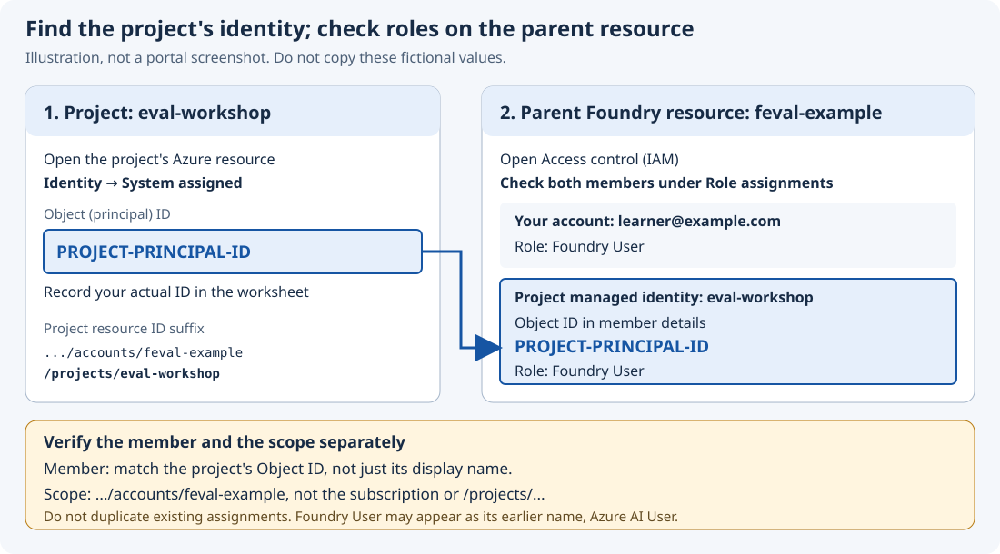

**English** | [한국어](../setup.md)

# Shared setup and safe resumption

[All paths](../../README.md) · [Setup map](#setup-map) · [Resume](#resume) · [Troubleshooting](reference.md#troubleshooting)

**Setup 1–7 is shared by introductory LIVE, Complete RAG, and Optional RAG.** Start a new workshop from [your chosen guide](../../README.md#choose-path). Introductory participants complete [activity 0](intro-lab.md#lab-0) before installation. DEMO needs only [its own local setup](offline.md#prepare).

Choose **new setup, an existing environment, or resumption** below. Do not repeat completed commands.

<a id="setup-options"></a>
## Choose the setup you need

| Your situation | Go to |
|---|---|
| Find an installation, sign-in, or configuration step | [Shared setup 1–7](#common-setup) |
| An authorized project and model already exist | [Existing environment](#existing-environment); skip resource creation |
| Create a new environment with CLI instead of the portal | [CLI alternative](#cli-provision); replaces setup 3–5 below |
| Continue interrupted work | [Resume procedure](#resume) → [result-file checkpoints](#resume-checkpoints) |
| Azure constraints prevent LIVE progress | [Switch to DEMO](#switch-to-demo) |
| Check usage and retained-resource costs | [Costs](#cost) |

<a id="common-setup"></a>
<a id="prepare"></a>
## Setup. Connect your computer to Azure

> [!IMPORTANT]
> **RAG participants return to their original path after setup 1–7:** [complete-path Search setup](complete-lab.md#search-setup) or [Optional RAG prerequisites](optional-rag.md#prerequisites), not the introductory activities. Here, prepare only the shared project and one answer/judge deployment.

If you already have an authorized environment, use [existing-environment setup](#existing-environment) instead of creating another one. Introductory participants then continue to [activity 1](intro-lab.md#lab-1); RAG participants return to their chosen guide above.

| Setup item | Shared setup value |
|---|---|
| Model / deployment name | **`gpt-6-luna` / `eval-model`** — same deployment for answers and judging |
| Region | **Sweden Central (`swedencentral`)** |
| Resources | **One project + one model deployment** |
| Identity and subscription | Microsoft Entra ID account + active Azure subscription. No API keys |
| New-environment starting role | **Active Owner** on the subscription, including an applicable inherited role |
| After the workshop | **Retain all resources** and [check costs](cleanup.md#retain-resources). Deletion requires a separate decision |

Owner lets one person create resources and assign roles in this path. It is not required for all Azure provisioning or existing-environment use. See the [permission contract](reference.md#permissions-contract) for other authorized role combinations.

This shared stage needs no search service, agent server, Docker, Git, azd, or Jupyter. Prepare RAG Search and additional models in your chosen guide afterward. **Do not enter real personal data, confidential information, or passwords.**

**Cost:** charges depend on the model and token usage. Budget alerts and TPM allocations do not automatically stop spending.

<a id="setup-map"></a>
### Setup progress map

| Step | Where | Completion signal |
|---|---|---|
| [1. Code and tools](#setup-tools) | Browser → VS Code | `LOCAL OK` |
| [2. Sign-in](#setup-sign-in) | Azure portal + terminal | Matching account, subscription, tenant |
| [3. Project](#setup-project) | Azure portal + Foundry | Provisioning `Succeeded` |
| [4. Permissions](#setup-permissions) | Azure portal IAM | Foundry User for user and project identity |
| [5. Model](#setup-model) | Foundry | `eval-model` deployed successfully |
| [6. Configuration](#setup-config) | Foundry → VS Code | `LIVE 조회 OK` for both fields |
| [7. Connectivity](#setup-smoke) | Terminal + Foundry | N01 answer and two scores with reasons |

<a id="tools"></a>
<a id="setup-tools"></a>
### Setup 1. Get the code and install tools

**Where: browser, then VS Code**

#### Open the folder and terminal

1. On the [repository page](https://github.com/junwoojeong100/foundry-evaluation-labs-v1), choose **Code → Download ZIP** and extract it. Skip this if you already have the files. If the repository is private, request an authorized ZIP or repository access. Azure permission and GitHub permission are separate.
2. Install the tools below, then open a new terminal.
3. In VS Code, choose **File → Open Folder** and open the folder that directly contains **`lab.py` and `requirements.txt`**, not an outer ZIP extraction directory.
4. Choose **Terminal → New Terminal**. Enter subsequent commands there.

**Use VS Code's terminal on your own computer**, not **Azure Cloud Shell** in the portal or a notebook cell.

- **Windows:** PowerShell. If another shell opens, choose the arrow beside the terminal's `+` → **Select Default Profile → PowerShell**, then open a new terminal.
- **macOS/Linux:** zsh or bash.

Use the browser to read the guide and operate Azure, and VS Code to **edit local files and run commands**. Reading a GitHub file does not change your local copy.

**If you see `>>>`**, you are in Python's interactive prompt. Type `exit()` before running commands. Do not use a Python file's Run button.

| Tool | Installation | Check |
|---|---|---|
| Python 3.10+ | [Python downloads](https://www.python.org/downloads/); enable PATH setup on Windows | macOS/Linux: `python3 --version`; Windows: `py -3 --version` |
| Azure CLI | [Installation instructions](https://learn.microsoft.com/cli/azure/install-azure-cli) | `az version` |
| Editor | [VS Code](https://code.visualstudio.com/) | Open the workshop folder and a terminal |

<details>
<summary>Open, preview, and save files in VS Code</summary>

1. Press **Ctrl+P / macOS Cmd+P**, enter a path such as `docs/en/policies.md`, and press Enter. If not found, use Explorer.
2. Read `.md` files with **View → Command Palette → Markdown: Open Preview to the Side**.
3. Edit the **source tab, not the preview**, then choose **File → Save**.

</details>

#### Create the virtual environment

Run **only the block for your operating system**. `.venv` holds the workshop's Python dependencies.

**macOS / Linux**

```bash
python3 -m venv .venv
source .venv/bin/activate
```

**Windows / PowerShell**

```powershell
py -3 -m venv .venv
.\.venv\Scripts\Activate.ps1
```

<details>
<summary>If Windows blocks Activate.ps1</summary>

Do not relax organizational policy. Replace every subsequent `python`, including the installation command, with **`.\.venv\Scripts\python.exe`**. For example, `python lab.py doctor` becomes `.\.venv\Scripts\python.exe lab.py doctor`. Leave commands starting with `az` unchanged.

</details>

#### Install packages and check local files

Install the packages:

```bash
python -m pip install -r requirements.txt
```

When installation finishes without errors, check the local files:

```bash
python lab.py doctor
```

**Checkpoint:** `LOCAL OK: Python ... , dev 8개, holdout 4개`.

The local files contain eight dev and four holdout cases. This does **not yet confirm Azure connectivity**.

<details>
<summary>Starting again in a new terminal or after moving the folder</summary>

Return to this folder and run only `source .venv/bin/activate` (macOS/Linux) or `.\.venv\Scripts\Activate.ps1` (PowerShell). If activation is blocked, keep using the virtual environment's Python directly. Do not recreate the environment or reinstall packages.

**Only if moving or renaming the folder broke the virtual environment**, follow [environment recovery](reference.md#moved-folder). Keep your existing results, configuration, and edited files.

</details>

<a id="working-files"></a>
**The only file to edit during shared setup is `config.json`.** In setup 6, copy `config.example.json` and save it beside `lab.py`. Do not create or edit it in advance.

Your chosen guide introduces later files: use the [introductory working-file table](intro-lab.md#working-files) or your RAG guide. Distinguish included examples from your earlier edits; do not overwrite personal work.

**Commands create output directories and reports automatically.** Do not manually edit generated JSON or reports. Keep original policies, questions, and prompts unchanged, and save working files as **UTF-8**.

**Next:** [Setup 2. Sign-in](#setup-sign-in) · [Setup map](#setup-map)

<a id="sign-in"></a>
<a id="setup-sign-in"></a>
### Setup 2. Sign in to the intended subscription

**Where: [Azure portal](https://portal.azure.com)**

1. Sign in with your Entra ID account and open the intended subscription under **Subscriptions**.
2. Check its **subscription ID and directory/tenant ID** in **Overview**. Use these values in the sign-in commands below.
3. Under **Access control (IAM) → View my access**, confirm an active **Owner** role. If you only have an eligible PIM role, activate it using your organization's process.
4. Under the subscription's **Resource providers**, check `Microsoft.CognitiveServices`. If needed, select **Register** and wait for `Registered`.

**Where: VS Code terminal.** Replace `YOUR-...` with the actual verified values, keeping the quotation marks.

```bash
az login --tenant "YOUR-TENANT-ID"
```

Complete browser authentication and MFA yourself, then run each command:

```bash
az account set --subscription "YOUR-SUBSCRIPTION-ID"
```

```bash
az account show --query "{account:user.name,subscription:name,subscriptionId:id,tenantId:tenantId,state:state}" --output json
```

**Checkpoint:** all three conditions match.

- `account` is the intended user.
- Subscription and tenant IDs match the portal. **Do not rely on the subscription's display name alone.**
- `state` is `Enabled`.

With several signed-in identities, the default subscription may belong to another account. If the subscription is missing, check the tenant.

**The browser and CLI have separate sign-in sessions.** If Foundry or a report link shows **Pick an account**, select the same account confirmed above. New Foundry may request another selection. CLI authentication does not authenticate a different or headless browser.

**Next:** [Setup 3. Project](#setup-project) · [Setup map](#setup-map)

<a id="create-project"></a>
<a id="setup-project"></a>
### Setup 3. Create a dedicated group and Foundry project

| Resource | Purpose | Example name |
|---|---|---|
| Resource group | Contains this workshop's resources | A unique name such as `rg-feval-a7k3m9` |
| Foundry resource | Parent account for deployments and access | A unique name such as `feval-a7k3m9` |
| Foundry project | Stores evaluation work and results | `eval-workshop` |
| Model deployment | Name the code calls; created in setup 5 | `eval-model` |

Replace `a7k3m9` with your own unique lowercase letters and digits. Use the names **actually created** in later steps, not just intended names.

#### Create the dedicated group in Azure portal

1. Choose **Resource groups → Create**, using the subscription from setup 2.
2. Enter a new dedicated group name and select **Sweden Central (`swedencentral`)**.
3. Choose **Review + create → Create** and wait for completion.

#### Create the project in Microsoft Foundry

Open [Microsoft Foundry](https://ai.azure.com).

1. Sign in with the same account. Enable **New Foundry** if a switch appears.
2. Choose **Create project**, or the project selector → **Create new project**.
3. Enter **`eval-workshop`** and open **Advanced options**.
4. Select the **same subscription, new dedicated group, and Sweden Central**. Use a **new Foundry resource**, not a shared one. Enter the unique resource name if the form allows it.
5. Choose **Create** and wait for the project to open.

**Stop if the interface asks you to create a Hub first.** This workshop uses a new Foundry project under a Foundry resource, not a classic hub-based project. Their setup and SDK contracts differ.

**Checkpoint:** **Manage → Project details / Resource details** identifies the project and parent resource, and their provisioning state is `Succeeded`. Match the names and location.

**Check the location of the group, parent resource, and project separately.** Creating a group in `swedencentral` does not put every child there automatically. Availability and quota are not guaranteed. Use the [model-availability guidance](reference.md#model-availability) if blocked; do not silently change region or disable existing network restrictions.

For commands instead of portal creation, use the [Azure CLI alternative](#cli-provision). It **replaces setup 3–5**; do not provision both ways.

**Next:** [Setup 4. Permissions](#setup-permissions) · [Setup map](#setup-map)

<a id="permissions"></a>
<a id="setup-permissions"></a>
### Setup 4. Verify generation and evaluation permissions

**Owner alone does not necessarily grant model and evaluation data access.** Your terminal uses **your user identity**; cloud evaluation uses the **project's managed identity**.

The parent-resource assignments below are this dedicated workshop's common starting configuration, not the only minimum scope for every evaluation or existing project. Access is inherited by child projects too. For shared or existing environments, confirm the required scope with the owner using the [permission contract](reference.md#permissions-contract).

#### Find the project's managed identity

Follow **project identity → parent-resource permissions**. These are different targets.

1. In Foundry, open the project's Azure resource from **Manage → Project details**. Its resource ID ends in **`/accounts/ACCOUNT/projects/PROJECT`**. Match the names to the resources verified in setup 3.
2. Under that project's **Identity → System assigned**, check its **Object (principal) ID** against the IAM member below. Do not copy the parent account's identity. If the menu or ID is missing, use the [managed-identity help](reference.md#managed-identity-access).

The following is an **illustration, not an actual portal screenshot**. Names and IDs are fictional; use values from your own environment.



#### Check roles on the parent Foundry resource

Open **Azure portal → parent Foundry resource → Access control (IAM)**. The scope ends in **`/accounts/ACCOUNT`**, with no `/projects/...` suffix.

| Role | Member | Scope |
|---|---|---|
| **Foundry User** | Your user account | Parent **Foundry resource** |
| **Foundry User** | The **project managed identity verified above** | Same **Foundry resource** |

Check **Role assignments** first. The role might appear under its previous name, **Azure AI User**. Do not duplicate an existing assignment.

For a missing user assignment, select **Add → Add role assignment → Foundry User → User, group, or service principal**, choose yourself, and **Review + assign**. For the project, use **Members → Managed identity** and verify that the selected object's ID exactly matches the project's recorded principal ID before assigning.

**Checkpoint:** both identities have Foundry User at the **parent resource scope**. Do not grant subscription-wide access or select another identity with a similar name. If propagation takes time, wait rather than creating duplicate assignments.

**Next:** [Setup 5. Model](#setup-model) · [Setup map](#setup-map)

<a id="deploy-model"></a>
<a id="setup-model"></a>
### Setup 5. Deploy one model

**Where: Foundry → Discover → Models**

1. Search for **`gpt-6-luna`** and inspect its actual name and available version. Do not substitute a similarly named model.
2. Select **Deploy → Custom settings**, targeting your new project/resource.
3. Review these settings, then choose **Deploy**.

| Setting | Value |
|---|---|
| Deployment name | **`eval-model`** |
| Model / version | **`gpt-6-luna`** / a version offered in this region; record it |
| Resource location | **Sweden Central (`swedencentral`)** |
| Deployment type | **Global Standard**, if supported, permitted, and quota is available |
| Tokens per minute | Start with **30K–60K TPM** if available within the model/SKU quota |

**Complete-RAG participants require version `2026-09-22`.** Check the recorded V1 comparison's [fixed-version condition](complete-lab.md#setup). If unavailable, choose another learning path before creating Search or additional models. Choosing another offered version above applies only to the separate introduction.

**Do not choose Provisioned/PTU or GPU deployment.** Global Standard is consumption-based, but a resource in `swedencentral` does **not** guarantee all inference stays in that region. If the model or quota is unavailable, follow [availability guidance](reference.md#model-availability). Do not silently switch models/regions or reduce someone else's quota.

**Checkpoint:** **Build → Models** shows `eval-model` as `Succeeded`, backed by **`gpt-6-luna`**. Record the model, version, and deployment type. **The model name and deployment name are different.**

One deployment serves both generation and judging, but these are separate calls. Catalog visibility or successful deployment does not prove Chat Completions, Structured Outputs, and cloud judging all work. Verify them with [the one-case smoke check](#setup-smoke). A judge can still be wrong.

**Next:** [Setup 6. Configuration](#setup-config) · [Setup map](#setup-map)

<a id="configure"></a>
<a id="setup-config"></a>
### Setup 6. Put the project endpoint in your configuration

1. Copy **Project endpoint** from the project's **Overview** or **Manage → Project details**. Do not guess it from the name or copy an API key.
2. In VS Code, open [config.example.json](../../config.example.json) and **Save As `config.json`**, beside `lab.py`.
3. Replace the example `project_endpoint` and save.

**Editing JSON**

- Keep field names on the left; change only the **specified values on the right**.
- Preserve straight double quotes `"`, commas, and braces. Do not add a comma after the last field.
- Copy **only from `{` through `}`**, without explanatory text or code-block fences.

```json
{
  "project_endpoint": "https://YOUR-ACCOUNT.services.ai.azure.com/api/projects/YOUR-PROJECT",
  "model_deployment": "eval-model",
  "judge_deployment": "eval-model"
}
```

**Change only the endpoint in the default path.** Check these values before saving:

| Value | Correct input | Do not use |
|---|---|---|
| `project_endpoint` | Address containing `.services.ai.azure.com/api/projects/PROJECT` | Portal browser URL, bare account endpoint, or `.openai.azure.com` address |
| Both deployment fields | **`eval-model`**, or your actual deployment name if different | Model name `gpt-6-luna` |
| Filename and location | **`config.json` beside `lab.py`** | `config.json.txt` |

No `.env` is needed.

```bash
python lab.py doctor --live
```

**Checkpoint:** both fields show **`LIVE 조회 OK`** (“LIVE lookup OK”), `eval-model`, and `gpt-6-luna`. Seeing the same deployment twice is expected. This checks lookup, not generation or evaluation.

**Next:** [Setup 7. Connectivity](#setup-smoke) · [Command status](#command-status) · [Setup map](#setup-map)

<a id="command-status"></a>
### Read command status before continuing

Read **completion message → case count → report**. A low score is an observation; resolve `ERROR:` before continuing. These rules apply to every `run`, `judge`, and `gate`.

<details>
<summary>Next action by output: complete, waiting, errors, BLOCK, and resumption</summary>

| Output | Meaning | Action |
|---|---|---|
| `평가 완료: …개 답변 × 2개 지표 (점수·이유 저장)` | All scores/reasons are validated and saved: “evaluation complete” | Check the case count, then continue. This does **not** mean the answers passed. |
| `기존의 완료된 결과를 읽었습니다` | Completed answers for the same inputs were reused; new collection messages such as `8/8 … 저장` do not appear | Check the summary count and `report.md`, then continue at the next unfinished step. Do not delete files to regenerate answers. |
| `D04 FAIL` or a low score | A collected answer failed a criterion | Record why and continue; do not resample for a better score. |
| `Judge: 아직 미평가` | “Judge: not evaluated yet” | Run this step's `judge`. |
| Only `Foundry 상태: completed` | The remote job ended; local collection may remain | Wait for **`평가 완료`**. Resolve any later `ERROR:`. |
| `아직 처리 중입니다` / exit `3` | “Still processing” | Repeat the **entire same `judge` command**, including `--like`. |
| `중단했습니다` / exit `130` | Interrupted from the terminal | Preserve the files and use the [resume checkpoints](#resume-checkpoints). |
| `ERROR:` / exit `1` | An input, environment, or execution error | Stop and [troubleshoot](reference.md#troubleshooting). |
| `BLOCK` / exit `2` | The quality gate holds the change | Record `gate.md` reasons and continue to activity 6, after addressing missing evidence. |
| `usage:` / `error:` with exit `2` | Missing required arguments or invalid options | Correct and rerun the command; this is not `BLOCK`. |

The default `judge` **status-polling budget is 300 seconds**. Authentication, submission, HTTP responses, and result collection can make total command time longer. If it exits with “still processing,” repeat the same command: it retrieves the saved remote job instead of submitting another one. Do not run it concurrently in another terminal.

**After an error or interruption, fix the cause and check the [result-file resume table](#resume-checkpoints).** Resume an incomplete `run` with the same inputs and `--out`; it skips saved answers, though an answer not saved before interruption may incur another call. If the remote job is still processing or completed and its IDs are saved, `judge` can resume polling/collection after a connection or local-save error. If submission stopped before its ID was saved, or the service reports `failed`/`canceled`, follow [remote-ID recovery](reference.md#resume), not a blind resubmission.

The completion message appears only after score/reason validation and `judge.json`/`report.md` are saved. Read the count, the report path after `보고서:`, and the per-case evidence under `사례별 근거`. Missing scores are not merely low scores. After completion, continue; repeating a completed `run` or `judge` reads saved results rather than generating better ones.

</details>

<a id="smoke"></a>
<a id="setup-smoke"></a>
### Setup 7. Verify one generated and evaluated answer

**Paid generation/evaluation calls begin here.**

#### Generate one answer

```bash
python lab.py run --mode live --prompt v1 --data data/my-case.example.jsonl --out results/setup-smoke
```

**Checkpoint:** `1/1  N01 저장` (“N01 saved”).

#### Evaluate the saved answer

`run` generates an answer; `judge` evaluates **that same saved answer**.

```bash
python lab.py judge results/setup-smoke
```

**Checkpoint:** `평가 완료: 1개 답변 × 2개 지표`: one answer, two metrics.

If still processing, repeat the same command. For an error or interruption, use the [status and resume guidance](#command-status).

#### Inspect the answer, scores, and reasons

```bash
python lab.py inspect results/setup-smoke N01
```

**Checkpoint:** business checks contain `"schema": true`, and both `groundedness` and `relevance` have scores from **1 to 5 with reasons**. Open the **Foundry report URL** and match the same question, answer, and scores. Without a URL, use **Build → Evaluations** and the `eval_id`/`run_id` in `results/setup-smoke/foundry-job.json`.

A low score does not invalidate connectivity. Authentication failures, truncated output, and missing scores must be fixed first. N01 is a setup case, not part of dev or holdout.

**A judge can give 5 while `citations` fails.** An answer may correctly reject the draft but also include `FAQ-DRAFT` in its citations array. That fails the exact citation-set contract. With valid JSON and complete scores/reasons, the smoke check still verifies connectivity; record the disagreement as an evaluation finding.

**Setup complete. Return to only your chosen path below.** RAG participants do not continue to introductory activity 1.

| Chosen path | Continue here |
|---|---|
| Introductory LIVE | [1. Set criteria](intro-lab.md#lab-1) |
| Complete RAG | [Check setup values and prepare Search](complete-lab.md#search-setup) |
| Optional RAG | [Optional RAG prerequisites](optional-rag.md#prerequisites) |

**If setup is blocked:** [Setup map](#setup-map) · [Command status](#command-status) · [Resume](#resume)

---

<a id="cli-provision"></a>
## Optional: create a new environment with Azure CLI

After completing setup 1–2 on this page, this path **replaces portal setup 3–5**. It requires Azure CLI **2.80.0+** and resource-creation/role-assignment permissions. Owner is one way to perform both tasks, not every participant's minimum role. It follows the [official project-creation instructions](https://learn.microsoft.com/azure/foundry/how-to/create-projects). No azd, search service, or agent server is added. Do not run it if your project and model already exist.

Use unique group and account names, project `eval-workshop`, and deployment `eval-model`. Replace placeholders with the subscription ID verified in setup 2 and your actual chosen values. These one-line commands work in macOS/Linux and PowerShell.

<details>
<summary>Only for a new CLI-created environment: creation, permissions, and deployment</summary>

### 1. Create a new group and parent Foundry resource

```bash
az group exists --name "YOUR-LAB-RESOURCE-GROUP" --subscription "YOUR-SUBSCRIPTION-ID"
```

Proceed with that name **only if the result is `false`**. If `true`, choose another unique name rather than reusing or deleting the existing group.

```bash
az group create --name "YOUR-LAB-RESOURCE-GROUP" --location swedencentral --subscription "YOUR-SUBSCRIPTION-ID" --tags purpose=foundry-evaluation-workshop retain=true
```

```bash
az cognitiveservices account create --name "YOUR-FOUNDRY-ACCOUNT" --resource-group "YOUR-LAB-RESOURCE-GROUP" --kind AIServices --sku S0 --location swedencentral --custom-domain "YOUR-FOUNDRY-ACCOUNT" --assign-identity --allow-project-management true --subscription "YOUR-SUBSCRIPTION-ID" --yes
```

**Do not omit `--assign-identity` or `--allow-project-management true`.** Project management needs the parent's identity and must be enabled at account creation. The custom domain must be globally unique. `retain=true` records intent; it is not a deletion lock or a billing stop.

### 2. Create the project and retrieve real IDs and endpoint

```bash
az cognitiveservices account project create --name "YOUR-FOUNDRY-ACCOUNT" --resource-group "YOUR-LAB-RESOURCE-GROUP" --project-name eval-workshop --location swedencentral --assign-identity --subscription "YOUR-SUBSCRIPTION-ID"
```

```bash
az cognitiveservices account show --name "YOUR-FOUNDRY-ACCOUNT" --resource-group "YOUR-LAB-RESOURCE-GROUP" --subscription "YOUR-SUBSCRIPTION-ID" --query "{id:id,location:location,state:properties.provisioningState}" --output json
```

```bash
az cognitiveservices account project show --name "YOUR-FOUNDRY-ACCOUNT" --resource-group "YOUR-LAB-RESOURCE-GROUP" --project-name eval-workshop --subscription "YOUR-SUBSCRIPTION-ID" --query "{id:id,location:location,state:properties.provisioningState,principalId:identity.principalId,endpoints:properties.endpoints}" --output json
```

Both resources should be `swedencentral` / `Succeeded`. The parent's `id` is **`YOUR-FOUNDRY-RESOURCE-ID`**. The project's `principalId` is **`YOUR-PROJECT-PRINCIPAL-ID`**. Use the **AI Foundry API** entry in `endpoints` for `config.json`. Do not construct an endpoint from a guessed name.

### 3. Grant the two necessary data roles

```bash
az ad signed-in-user show --query "{account:userPrincipalName,objectId:id}" --output json
```

Verify the account again; its `objectId` is **`YOUR-USER-OBJECT-ID`**. Check existing assignments in the parent's IAM first, then assign **only missing roles**. CLI creation does not guarantee the portal's automatic assignments.

```bash
az role assignment create --assignee-object-id "YOUR-USER-OBJECT-ID" --assignee-principal-type User --role "53ca6127-db72-4b80-b1b0-d745d6d5456d" --scope "YOUR-FOUNDRY-RESOURCE-ID" --subscription "YOUR-SUBSCRIPTION-ID"
```

```bash
az role assignment create --assignee-object-id "YOUR-PROJECT-PRINCIPAL-ID" --assignee-principal-type ServicePrincipal --role "53ca6127-db72-4b80-b1b0-d745d6d5456d" --scope "YOUR-FOUNDRY-RESOURCE-ID" --subscription "YOUR-SUBSCRIPTION-ID"
```

The GUID is **Foundry User**. Both scopes end at `/accounts/ACCOUNT`; do not expand them to the subscription or another resource. This parent scope is inherited by child projects, so it is the **starting configuration for your dedicated environment**, not permission to widen access in a shared account. Your account is a `User`; the project identity is a `ServicePrincipal`, distinct from the parent account's managed identity.

### 4. Check model/SKU quota, then deploy once

```bash
az cognitiveservices model list --location swedencentral --subscription "YOUR-SUBSCRIPTION-ID" --query "[?model.name=='gpt-6-luna']" --output json
```

```bash
az cognitiveservices usage list --location swedencentral --subscription "YOUR-SUBSCRIPTION-ID" --query "[?name.value=='OpenAI.GlobalStandard.gpt-6-luna'].{name:name.value,current:currentValue,limit:limit}" --output json
```

The first lookup keeps the entire model entry so SKU information is not discarded. Check the model/version, `GlobalStandard` support, and capacity units. The example below is the recorded **60K TPM / capacity 60** configuration. Use it only after confirming that the current model/SKU still uses **one capacity unit = 1000 TPM** and that **`limit - current ≥ 60`**. Do not infer other models' units or usage names from this example.

Quota lookup needs separate subscription-scoped read permission. A 403 or empty list does not mean “zero quota”; check account, access, and availability using the [availability guidance](reference.md#model-availability). Available quota does not guarantee physical deployment capacity.

```bash
az cognitiveservices account deployment create --name "YOUR-FOUNDRY-ACCOUNT" --resource-group "YOUR-LAB-RESOURCE-GROUP" --deployment-name eval-model --model-name gpt-6-luna --model-version "YOUR-MODEL-VERSION" --model-format OpenAI --sku-name GlobalStandard --sku-capacity 60 --subscription "YOUR-SUBSCRIPTION-ID"
```

Use an **actually listed version**. The September 27 rehearsal used `2026-09-22`; that is not a guarantee of future availability. Return to [setup 6](#setup-config), then complete lookup and the smoke check. No API key needs to be retrieved. **Do not finish by deleting resources.**

Complete RAG requires the [specified answer version](complete-lab.md#setup) for recorded V1 comparison. Do not confuse this with the introductory path, which can use another offered version.

</details>

<a id="existing-environment"></a>
## If you already have an authorized environment

Do not create resources or rename/reconfigure an existing model. Introductory participants complete [activity 0](intro-lab.md#lab-0) first if needed.

You need an existing **Foundry project, not a classic hub-based project**, and an accessible compatible deployment. A project endpoint has the form `https://ACCOUNT.services.ai.azure.com/api/projects/PROJECT`. A classic hub connection string or model-only endpoint is not interchangeable.

An existing environment must also meet this workshop's **`gpt-6-luna` / `swedencentral` contract**. Its actual deployment name may differ; silently substituting a different model or region is not the same experiment. [Model names, deployment names, model versions, and API versions are distinct](reference.md#model-endpoint-contract).

**Complete-RAG participants return to [complete-path Search setup](complete-lab.md#search-setup) instead of step 5 below.** Verify the required deployment name/model version on existing resources first; do not silently change a shared deployment to match.

**Optional-RAG participants return to [Optional RAG prerequisites](optional-rag.md#prerequisites) instead of step 5 below.** Completing the full complete-RAG workshop is not a prerequisite.

1. Obtain the actual tenant/subscription, resource names, region, project endpoint, deployment name, access permissions, and usage/cost/retention scope from the owner. Do not request API keys or shared passwords.
2. Complete [local setup](#setup-tools) and [sign-in checks](#setup-sign-in). Resource creation is not required, so Owner activation/provider registration is not a prerequisite for this path.
3. Verify [the two data identities](#setup-permissions) against the [existing-environment permission scope](reference.md#permissions-contract). Ask an authorized owner to grant anything missing; do not widen shared-account access yourself.
4. Verify Chat Completions, Structured Outputs, and judging through [configuration](#setup-config) and the [smoke case](#setup-smoke).
5. Continue to [activity 1](intro-lab.md#lab-1). Retain shared resources and operate only within the owner's agreed scope.

| Information to confirm with the owner | Use |
|---|---|
| Tenant ID and subscription ID | Match portal and CLI context |
| Group, Foundry resource, project, and region | Identify permission targets and retention scope |
| Project endpoint and actual deployment name | `config.json`; use the deployment name, not the model name |
| Actual user/project-identity roles and scopes; usage, cost, and cleanup permissions | Verify access and protect shared resources |

If you cannot inspect the project's identity, ask the owner to match the IDs and roles. `eval-workshop` and `eval-model` are names for the new-resource path, not instructions to rename shared resources. If using one shared deployment for both purposes, put its actual name in both configuration fields.

<a id="switch-to-demo"></a>
## Switching from blocked LIVE work to DEMO

1. Stop new LIVE calls. Record the checkpoint, error, and already-created resources; preserve configuration, questions, and results.
2. Follow [DEMO setup](offline.md#prepare), reusing installed Python/editor/environment and preserving the LIVE records.
3. Use `results/demo-*` directories and the DEMO commands. Do not mix modes or compare authored scores with LIVE scores.
4. [Verify retention and costs](cleanup.md#retain-resources) for any Azure resources. Switching modes does not delete resources or cancel already-submitted evaluations.

<a id="cost"></a>
## Costs

Check the call scale in [introductory LIVE](intro-lab.md#prepare) or your chosen RAG guide, alongside [model pricing](https://azure.microsoft.com/pricing/details/azure-openai/) and your deployment type. Generation token totals exclude judge usage.

Scope **Cost Management → Cost analysis** to your dedicated group. Reporting may lag. Alerts do not stop spending, and resource retention is not a billing pause. Review [retention/cleanup](cleanup.md) even if stopping early.

<a id="resume"></a>
## Resume later

The tables below are for **introductory LIVE/DEMO with `lab.py`**. `advanced_lab.py` has different files and fixed output paths; use [complete-RAG status and resumption](complete-lab.md#resume).

1. Reopen the folder containing `lab.py` in VS Code and open a terminal.
2. Reactivate `.venv`: `source .venv/bin/activate` on macOS/Linux or `.\.venv\Scripts\Activate.ps1` on Windows. If Windows activation is prohibited, keep using `.\.venv\Scripts\python.exe`. Do not reinstall packages every time.
3. Find your last completed stage and next command in the [result-file resume table](#resume-checkpoints). If LIVE authentication expired, [sign in again](#setup-sign-in). DEMO needs no sign-in.

| Saved state | Resume action |
|---|---|
| `run` saved only some answers | Repeat the same command, inputs, and `--out`. Saved rows are not regenerated. |
| `judge` still processing | Repeat the entire command, including `--like`, to retrieve the existing job. |
| `judge` collection/persistence returned `ERROR:` | Fix the cause, then resume the entire command. If remote creation is uncertain, check [ID recovery](reference.md#resume) first. |
| `run`/`judge` already completed | Continue to the next step; the same inputs validate/reuse saved results, not a new experiment. |
| Missing human review has been added | Repeat the same `gate` command to use the latest review. No new generation or judging is needed. |
| Prompt, data, or configuration changed | Design a new experiment with new output names; do not overwrite earlier evidence. |

Do not delete `run.json` or `judge.json` to force another attempt. A call interrupted between response and persistence might be charged again. See [recovery details](reference.md#resume) if remote IDs were not saved.

`prompts/my-v2.txt` and `data/my-case.jsonl` are included example working files. Inspect their contents and your own edits before resuming; do not overwrite them with a fresh copy. Distinguish reusing an example from editing it yourself.

<a id="resume-checkpoints"></a>
### If you forgot the last checkpoint

Inspect only your own results. For DEMO, substitute `demo-baseline`, `demo-candidate`, and `demo-holdout`.

| Existing evidence / missing step | Continue |
|---|---|
| Baseline `run.json` complete; no judge | [Activity 3](intro-lab.md#lab-3): your D04 judgment, then judge |
| Baseline judge complete; no candidate | [Activity 4](intro-lab.md#lab-4): hypothesis and existing working-file inspection |
| Candidate answers complete; no judge/comparison | [Activity 4](intro-lab.md#lab-4): missing judge/comparison |
| Comparison exists; no D06 review | [Activity 4 review](intro-lab.md#lab-4) |
| Candidate done; holdout/judge/H04/gate incomplete | First missing step in [activity 5](intro-lab.md#lab-5) |
| Gate and decision recorded | [Activity 6](intro-lab.md#lab-6) |

For DEMO, use the same numbered activities in [its guide](offline.md). Files are only clues: resume a `collecting` run or in-progress judge before proceeding. Preserve `--like`, all input evidence, and your original judgment.

If `gate.md` exists but required human review is missing, add the actual person's review and repeat the same `gate`. This is different from generating/judging again to eliminate a low score.

[Back to setup choices](#setup-options)
