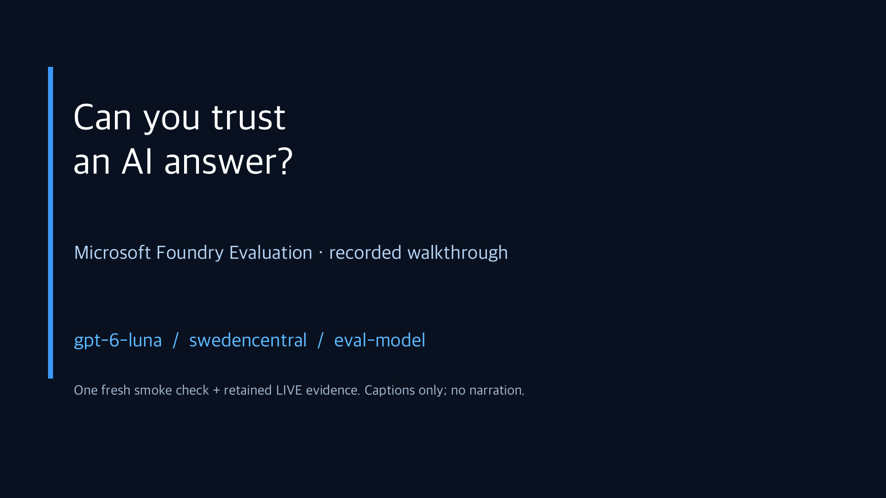
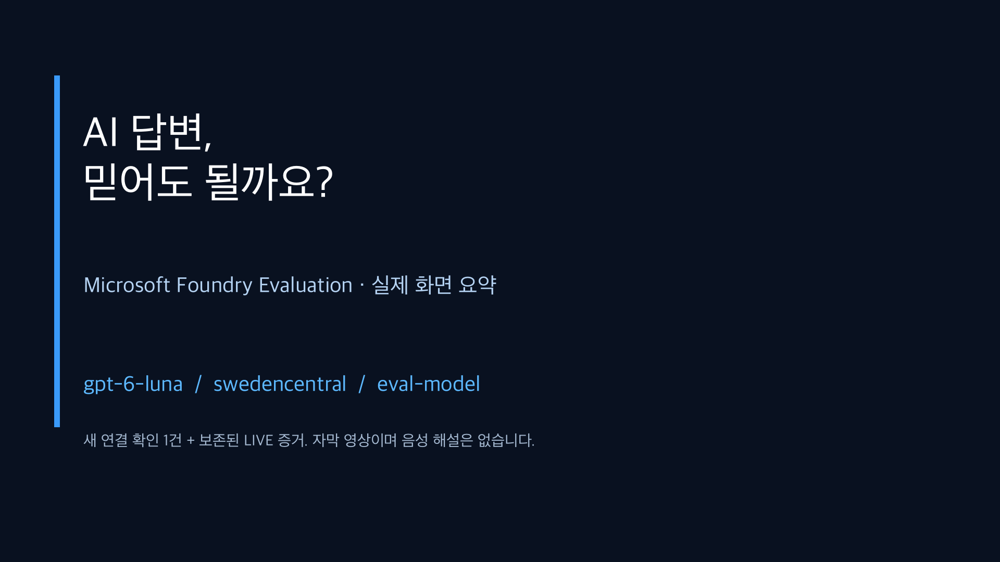

# Recorded workshop summaries / 실습 요약 영상

[English guide](../../README.md) · [국문 가이드](../../README.ko.md)

**Two localized edits of the same ten real screen recordings.** Each summary is **3 minutes 50 seconds**, H.264 MP4 at **1920 × 1080 / 24 fps**. Both are **silent, with burned-in chapter titles and captions**; separate SRT subtitle files are included. There is no narration or music.

| Language | Video | Subtitles |
|---|---|---|
| English | [Watch / download MP4](workshop-summary.en.mp4) | [English SRT](workshop-summary.en.srt) |
| 한국어 | [MP4 보기 / 다운로드](workshop-summary.ko.mp4) | [국문 SRT](workshop-summary.ko.srt) |

If GitHub opens a file page rather than a player, choose **View raw / Download**, then open the MP4 in a browser or video player. These are actual video files, not links to a promised future upload.

[](workshop-summary.en.mp4)

[](workshop-summary.ko.mp4)

## What was recorded

The source footage was captured with **native headless Playwright video recording** while operating the actual Azure portal, Microsoft Foundry, and a local display of **real subprocess CLI output**. The terminal is labeled as a scripted recording; it is not a fabricated VS Code window or a replay of invented output.

Browser footage was captured at 1280 × 720 and composed with 1080p titles/captions into the 1920 × 1080 exports.

The Azure resources are the retained `gpt-6-luna` / `swedencentral` workshop environment. The recording makes **one fresh paid smoke-generation call and evaluates that saved answer**. It then inspects and compares the **already-completed LIVE baseline, candidate, and holdout**. Cached results are explicitly labeled; they are not presented as newly generated benchmark results.

The two languages share this factual footage. Only titles and explanatory captions differ. The experimental Korean inputs and CLI output are not silently translated or changed between versions.

Editing removes setup/dead time, changes playback speed to fit the chapters, and adds introductory/closing cards, chapter numbering, captions, and opaque privacy bars. The recordings are not a slideshow assembled from standalone screenshots.

## Chapters

| Time | English | 한국어 |
|---|---|---|
| 00:00 | Introduction and recording scope | 소개와 녹화 범위 |
| 00:07 | Retained Azure resources and tags | 보존한 Azure 리소스와 태그 |
| 00:25 | Real Azure CLI and live connection checks | 실제 Azure CLI·연결 확인 |
| 00:47 | Model versus deployment name | 모델명과 배포 이름 |
| 01:05 | One fresh smoke generation/evaluation | 새 답변 한 건의 생성·평가 |
| 01:33 | Inspect retained baseline D04 | 보존된 baseline D04 확인 |
| 01:55 | Match the answer in Foundry | Foundry에서 같은 답변 대조 |
| 02:17 | Business improvement and judge regression | 업무 검사 개선과 Judge 회귀 |
| 02:39 | Compare the two dev runs | 같은 dev 두 실행 비교 |
| 02:57 | Frozen holdout and BLOCK | 고정 holdout과 BLOCK |
| 03:23 | Extra case and evidence retention | 추가 사례와 증거 보존 |
| 03:43 | Closing: human review is still required | 마무리: 실제 사람 검토 필요 |

## Important limits

- **BLOCK is retained**, including Relevance failures and incomplete actual human review. Assistant-attributed reviews are not human approval.
- Login flows are omitted. Identifiers are redacted in the rendered browser/terminal content, and exported videos have opaque header/caption bars and stripped container metadata. Credentials and raw recordings are not committed.
- The original rehearsal's scores are a single observed run, not a model-quality guarantee. The fresh smoke recording is a separate case and may have different scores.
- The Azure resource group contains a **separate failed organization-policy diagnostic deployment** referencing a missing central Log Analytics workspace. Actual Foundry resources and evaluation calls work. The warning is documented for the policy owner; no policy is disabled and no shared governance resource is created or deleted.
- All created Azure resources, model deployments, and evaluation records remain. Retention does not imply free use or stopped billing.

The [manifest](manifest.json) records durations, chapters, file sizes, and SHA-256 hashes. The English/Korean captions are available in the SRT files, without needing audio.

## 국문 안내

국문·영문 영상은 **동일한 실제 녹화 원본을 각각 편집한 자막 버전**입니다. 실제 Azure 포털·Foundry 조작과 CLI 실행을 headless 브라우저에서 녹화했습니다. 음성 해설이나 배경 음악은 없습니다.

연결 확인용 답변 한 건은 새로 생성·평가했고, dev·candidate·holdout은 **기존 LIVE 실측 결과를 재사용**했습니다. 새로운 전체 성능 실험처럼 표현하지 않습니다. 로그인·식별 정보는 편집본에서 제외했으며 원본 녹화와 자격 증명은 저장소에 올리지 않습니다.

Judge 회귀와 실제 사람 검토 미완료에 따른 **BLOCK을 그대로 유지**했습니다. 영상은 전체 실습 가이드와 증거 기록을 대신하지 않습니다. 조직 진단 정책의 중앙 작업 영역 누락은 별도 관리자 확인 사항으로 기록했고, Azure 리소스는 모두 보존했습니다.

GitHub에서 플레이어가 보이지 않으면 **View raw / Download**로 MP4를 연 뒤 재생합니다. 각 언어의 SRT 자막도 함께 제공됩니다.

## Authoring and verification

The optional [local media tooling](../../tools/media/workshop_video.py) uses FFmpeg/ffprobe and [Pillow](../../tools/media/requirements.txt). It is **not required to take the workshop**.

The authoring tools were run on macOS with Bash and an installed Korean-capable system font. On other platforms, adapt the Bash/font paths before rendering. Font files are not redistributed; watching the videos and taking the workshop do not require these authoring tools.

Raw WebM clips, capture metadata, command timing/exit-code evidence, and intermediate edits stay under ignored `results/media/`. Recording helpers expect an already-verified local Azure environment and never create credentials. An authenticated local browser context was reused in memory for headless capture; no cookie/token file is published.

With your own recorded source files and metadata present, render and verify locally:

```bash
python -m pip install -r tools/media/requirements.txt
```

```bash
python tools/media/workshop_video.py render
```

```bash
python tools/media/workshop_video.py verify
```

Verification includes full video decoding, codec/pixel format, dimensions, duration, chapter/subtitle timing, file hashes, and the release-size limit. Review representative frames for readability and redaction before publishing; passing a codec check alone is not a privacy or content review.
