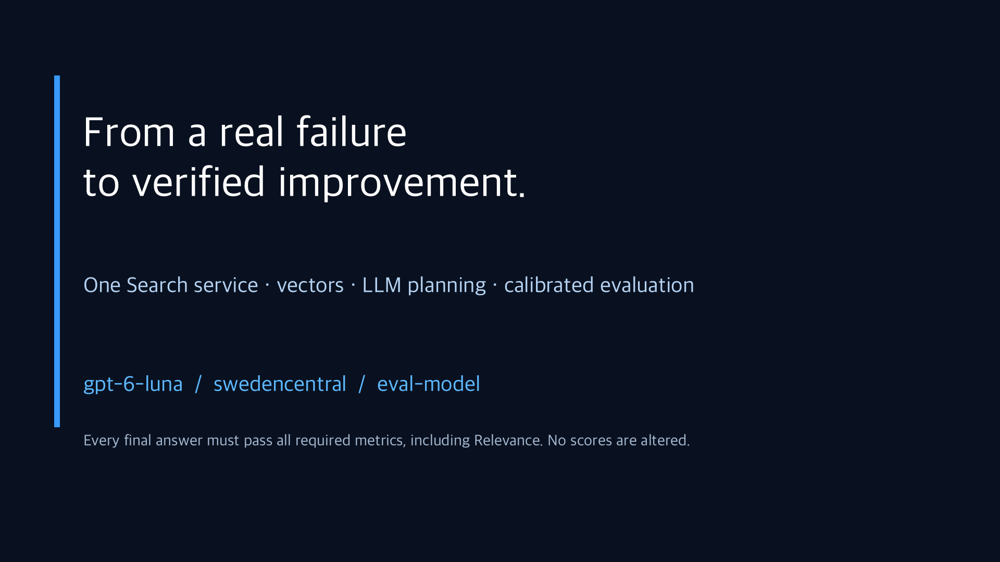
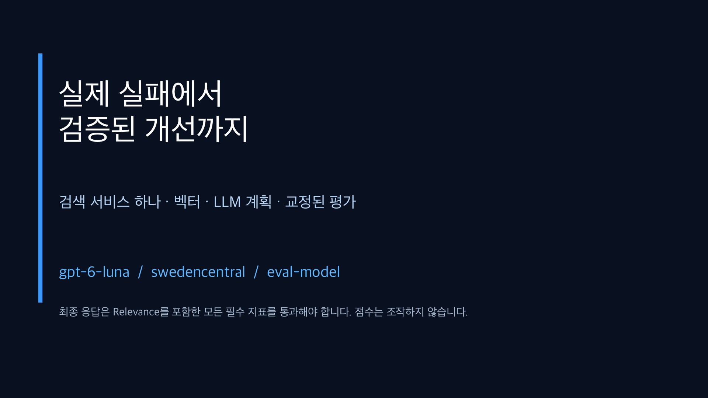

# Completed workflow recordings / 완결형 실습 요약 영상

[English guide](../../en/complete-lab.md) · [국문 가이드](../../complete-lab.md)

These are the current recommended summaries: **2 minutes 54 seconds each**, 1080p H.264, with English/Korean burned-in captions and SRT files. **No narration or music.**

| Language | Video | Subtitles |
|---|---|---|
| English | [Watch / download](completion-summary.en.mp4) | [English SRT](completion-summary.en.srt) |
| 한국어 | [보기 / 다운로드](completion-summary.ko.mp4) | [국문 SRT](completion-summary.ko.srt) |

[](completion-summary.en.mp4)

[](completion-summary.ko.mp4)

If GitHub opens a file page, use **View raw / Download** to play the MP4.

## What is real, and what is scripted?

Seven native headless Playwright scenes record the actual Azure/Foundry portal and actual CLI execution. There is one shared Basic Search service, a populated 1536-dimensional vector index, a vectorizer, and real Foundry IQ `modelQueryPlanning` activity.

The V1 failure is a preserved, sanitized actual earlier model response, not an invented bad answer. V2 responses and evaluations were executed live. Recording reads completed evaluation evidence and performs fresh retrieval demonstrations; it does not reroll model scores.

Two evaluation scenarios use **explicit scripted user follow-ups**: one supplies a missing travel date after the assistant asks, and another requests a supported Finance inquiry checklist rather than an unavailable overseas amount. These are authored test-user turns, not facts fabricated by the assistant or real human approvals.

**Every final V2 holdout case passes business, retrieval, Groundedness, builtin Relevance, and policy task success.** No failed metric is excluded, and no score is overwritten. Initial clarification/handoff behavior is also checked. Human production approval is still separate.

Native capture is 1280 × 720, composed with 1080p cards/captions. Editing trims waits and adjusts speed. Privacy bars are opaque; identifiers and container metadata are removed from published footage. Raw recordings and local configuration are not committed.

## Chapters

| Start | Topic |
|---|---|
| 00:00 | Introduction |
| 00:07 | One shared Search service and two indexes |
| 00:25 | Calibrated evaluation and the genuine V1 failure |
| 00:49 | V2 source selection and completed user follow-up |
| 01:11 | Actual vectors and LLM-planned search |
| 01:39 | Planned knowledge-base configuration |
| 01:57 | Fresh frozen scenarios and all-metrics acceptance |
| 02:25 | Completed Foundry evaluation |
| 02:47 | Closing and production-approval distinction |

## 국문 안내

실제 포털·CLI 녹화 7개 장면을 국문·영문으로 편집했습니다. **Basic 검색 서비스 하나**에 기본/벡터 인덱스를 두고, 실제 임베딩과 LLM 검색 계획을 사용합니다.

V1의 실제 실패를 보존했고 V2는 필요한 사용자 후속 대화까지 완료합니다. 날짜나 회사 규정을 모델이 만들어 낸 것이 아닙니다. 후속 사용자 발언은 명시된 평가용 데이터입니다.

**새 V2 최종 사례 8개 모두 Relevance를 포함한 모든 필수 지표를 통과**했습니다. 초기 추가 질문·안내도 검사했습니다. 점수를 바꾸거나 실패 지표를 빼지 않았으며 실제 운영 승인은 별도입니다.

기존 Free 검색 서비스와 이전 실험의 실패·검증 기록은 새 경로와 영상을 확인한 뒤 정리합니다. 현재 V1/V2 비교·Judge 교정·새 합격 증거는 새 실습 자료로 보존합니다.

해당 정리는 완료했으며 현재 실습에 사용하는 검색 서비스는 공용 Basic 하나입니다. 이전 영상·결과 대신 이 완료본을 사용합니다.

## Authoring

The [success profile](../../../tools/media/success_video.py) uses the shared local recorder/editor. Authoring requires the private current-run artifacts, FFmpeg, Pillow, Bash, and a Korean-capable font; none is required to watch.

```bash
python tools/media/success_video.py render
```

```bash
python tools/media/success_video.py verify
```

The [manifest](manifest.json) contains hashes, sizes, durations, and chapter times. Full decoding, browser playback/seeking, subtitle timing, frame readability and identifier redaction must be checked before publishing.
