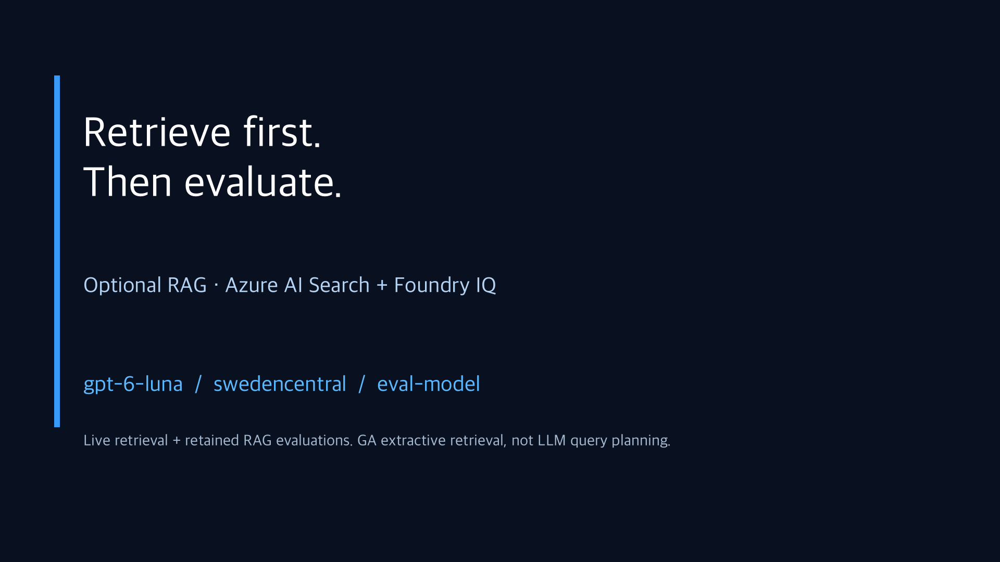
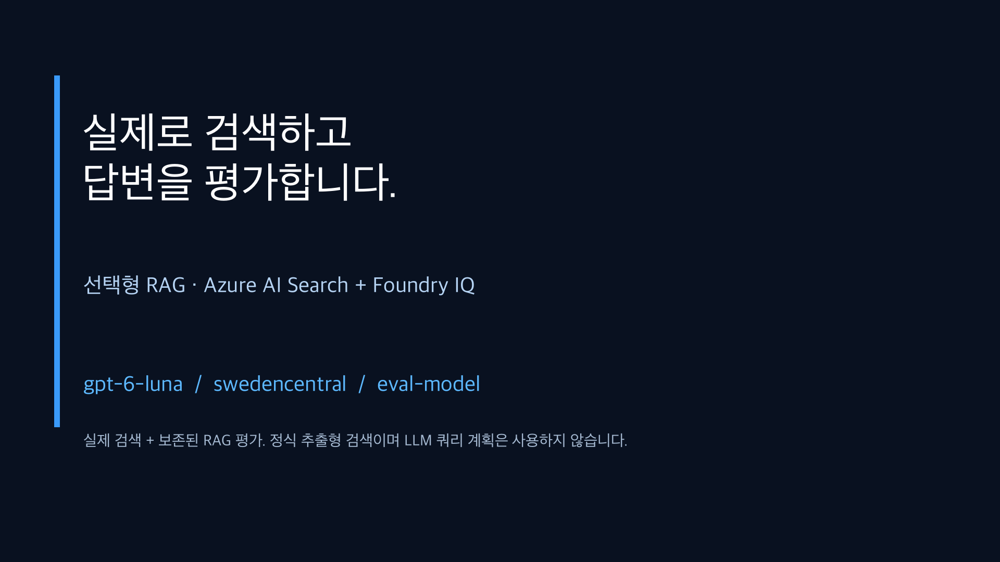

# Optional RAG recordings / 선택형 RAG 요약 영상

[English Optional guide](../../en/optional-rag.md) · [국문 Optional 가이드](../../optional-rag.md) · [Core recordings](../README.md)

These are **two localized edits of six actual headless screen recordings**, not two independent benchmarks. Each video is **2 minutes 30 seconds**, H.264 MP4, **1920 × 1080 / 24 fps**, with burned-in captions and a separate SRT. **There is no narration or music.**

| Language | Video | Captions |
|---|---|---|
| English | [Watch / download MP4](rag-summary.en.mp4) | [English SRT](rag-summary.en.srt) |
| 한국어 | [MP4 보기 / 다운로드](rag-summary.ko.mp4) | [국문 SRT](rag-summary.ko.srt) |

[](rag-summary.en.mp4)

[](rag-summary.ko.mp4)

If GitHub shows a file page, choose **View raw / Download** to play the MP4.

## Recorded scope

- The actual Azure portal shows the new **Search service (Foundry IQ)**, seven-document index, Knowledge Base, and active search-index Knowledge Source.
- The CLI performs **fresh Search and IQ retrieval requests**, then inspects **retained LIVE answers and evaluation results**. It does not regenerate answers or regrade them for a better result.
- Foundry shows the completed RAG evaluation. The judge's context is the same per-case retrieved context used by generation.
- The GA `2026-04-01` path is **minimal/extractive**, without vectors or LLM query planning. `gpt-6-luna` generates and judges answers separately.
- Both routes retrieved identical contexts in this four-case run. The extra citation in IQ D02 is an answer-level issue, not evidence of an inferior retriever.
- All resources remain. Free plans have limits; generation/judging is still chargeable. No API keys or login steps are published.

Native 1280 × 720 footage was trimmed and time-edited, then composed with 1080p titles/captions. Identifiers are redacted and privacy bars are opaque. Raw recordings, command evidence, and local configuration remain under ignored `results/media-rag/`.

## Chapters

| Time | English | 한국어 |
|---|---|---|
| 00:00 | Optional RAG introduction | 선택형 RAG 소개 |
| 00:07 | Real Search resource and index | 실제 Search 리소스와 인덱스 |
| 00:25 | Semantic Search retrieval | 실제 semantic 검색 |
| 00:47 | Actual IQ knowledge base/source | 실제 IQ 지식 기반과 소스 |
| 01:07 | IQ retrieval and saved answer | IQ 조회와 저장된 답변 |
| 01:33 | Foundry evaluation | Foundry 평가 |
| 01:55 | Controlled comparison | 조건을 고정한 비교 |
| 02:23 | Retain evidence; review required | 증거 보존·검토 필요 |

## 국문 안내

실제 Azure 포털·Foundry·CLI 화면 여섯 장면을 녹화해 국문·영문 자막 버전으로 편집했습니다. Search와 IQ 조회는 녹화 중 실제 실행했고, 답변·Judge 점수는 **이번 Optional 실습의 보존된 LIVE 결과**입니다. 정지 이미지를 이어 붙인 슬라이드 영상이 아닙니다.

두 경로 모두 필수 청크를 찾았지만 답변 검사·Relevance는 모두 통과하지 않았습니다. **검색 품질과 답변 품질은 다르며, 한 번의 결과로 IQ 우열을 주장하지 않습니다.** `REVIEW_REQUIRED`, 원본 결과, 생성한 Azure 자원을 유지했습니다. 음성 해설은 없으며 SRT 자막을 별도로 제공합니다.

## Reproduction and verification

The [RAG media profile](../../../tools/media/rag_video.py) reuses the [core recorder/editor](../../../tools/media/workshop_video.py) without overwriting its videos. Authoring requires the retained local rehearsal/recording metadata, FFmpeg, Pillow, and the documented macOS font/Bash paths; none is needed just to watch.

```bash
python tools/media/rag_video.py render
```

```bash
python tools/media/rag_video.py verify
```

The [manifest](manifest.json) records file hashes, sizes, durations, and chapters. Validate full decoding, browser playback/seeking, subtitle timing, readability, and identifier redaction before publishing.
